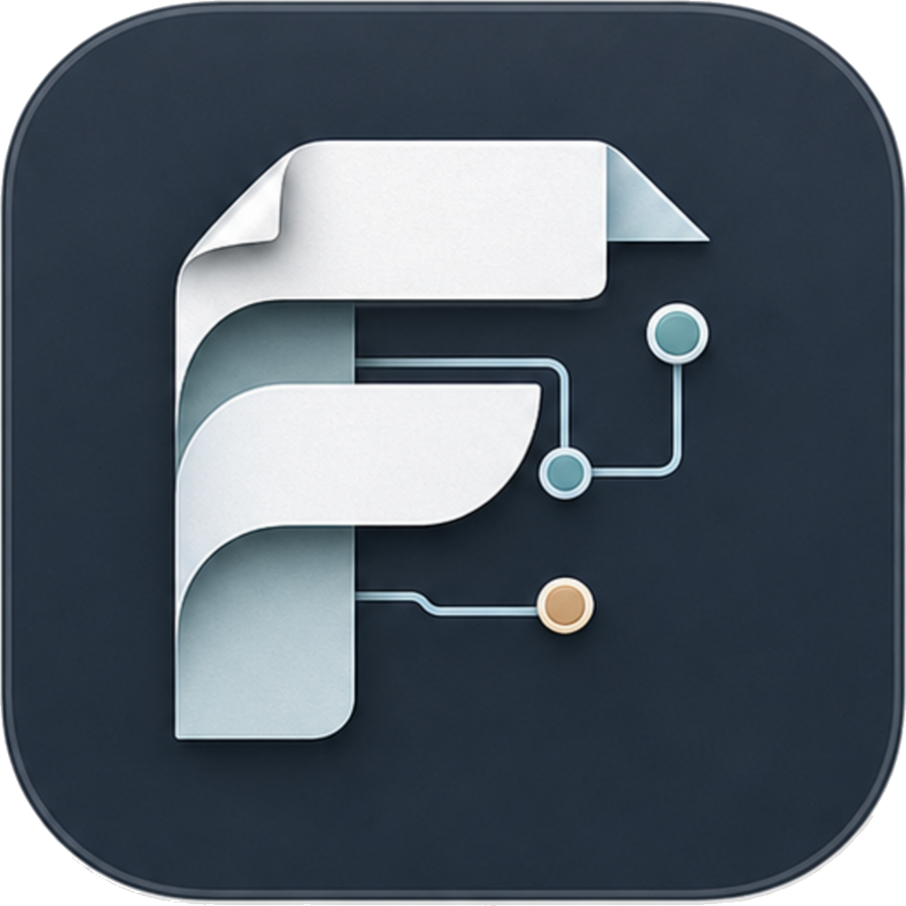

<p align="center">
  
</p>

<h1 align="center">FOSSredder</h1>

<p align="center">
  <a href="https://github.com/Wiiii90/FOSSredder/actions/workflows/pipeline.yml?query=branch%3Amaster"></a>
  <a href="https://codecov.io/gh/Wiiii90/FOSSredder/branch/master"></a>
  <a href="https://github.com/Wiiii90/FOSSredder/actions/workflows/pipeline.yml?query=branch%3Adevelop"></a>
  <a href="https://codecov.io/gh/Wiiii90/FOSSredder/branch/develop"></a>
</p>

**FOSSredder** is a deliberately overengineered Windows desktop application built for a concrete, real-world use case: extracting structured data from PDF bank statements issued by Commerzbank, a major German banking institution, in order to automate the annual allocation of recoverable costs to tenants.

The application replaces a manual, Excel-based workflow with a semi-automated pipeline. It extracts transaction data from PDF statements using OCR and heuristic parsing, followed by a custom matching engine that pre-fills entries by linking them to specific actors, properties, and contracts. A dedicated review interface allows for human-in-the-loop validation, streamlining the process of identifying recoverable costs before the final export back into a structured Excel format.

While the core problem could be addressed with simpler scripts, this project also serves as an engineering exercise in modular system design, extensibility, automation, and AI-assisted development workflows.
## Technology Stack

- **Application:** C++20, Qt 6, QML / Qt Quick
- **Architecture:** Modular CMake targets for [core](core), [persistence](persistence), [ui](ui), [infra](infra), and [app](app)
- **Data & Persistence:** SQLite, nlohmann-json
- **Document Processing:** Poppler, OpenCV, Tesseract
- **Testing & Quality:** GoogleTest, clang-tidy, LLVM coverage, Codecov
- **Build & Packaging:** CMake, vcpkg, Inno Setup, GitHub Actions
- **Documentation:** Doxygen, GitHub Pages
- **Localization:** Qt Linguist catalogs, bundled Tesseract OCR models
- **Platform:** Windows 10+

## Quick Start

Prerequisites:

- CMake 4.0.1 or newer
- vcpkg in manifest mode
- A Windows C++ toolchain supported by the configured CMake presets
- Inno Setup 6 when building the Windows installer

Minimal setup:

```powershell
git clone https://github.com/microsoft/vcpkg.git C:\vcpkg
C:\vcpkg\bootstrap-vcpkg.bat
[Environment]::SetEnvironmentVariable('VCPKG_ROOT', 'C:\vcpkg', 'User')
```

Build the app:

```powershell
cmake --preset app
cmake --build --preset release-app
```

Fast Ninja app build:

```powershell
cmake --preset app-ninja-fast
cmake --build --preset release-app-ninja-fast
```

Run tests:

```powershell
cmake --preset tests
cmake --build --preset release-tests
ctest --preset release-tests --output-on-failure
```

Build the Windows installer:

```powershell
cmake --build --preset release-installer
```

Installer output:

```text
.build/app/dist/FOSSredder-Setup-<version>-win-x64.exe
```

### Project Links

- **Design:** [Design documentation](docs/DESIGN.md)
- **Code Reference:** [Doxygen documentation](https://wiiii90.github.io/FOSSredder/api/)
- **Coverage:** [Coverage report](https://wiiii90.github.io/FOSSredder/coverage/)
- **Releases:** [GitHub releases](https://github.com/Wiiii90/FOSSredder/releases)
- **License:** [MIT License](LICENSE)
