# Design — FOSSredder

Author: Wilhelm Altemeier

## Table of Contents
1. [Executive Summary](#1-executive-summary)
2. [System Context](#2-system-context)
3. [Architecture Design](#3-architecture-design)
4. [Core](#4-core)
5. [Infrastructure](#5-infrastructure)
6. [User Interface](#6-user-interface)
7. [Quality Assurance](#7-quality-assurance)
8. [Deployment](#8-deployment)
9. [Security & Privacy](#9-security--privacy)
10. [Appendix](#10-appendix)

---

## 1. Executive Summary <a id="1-executive-summary"></a>

FOSSredder is a local-first system for extracting, managing, and analyzing financial data from bank statements in PDF or image formats. The system transforms raw documents into a structured SQLite database to facilitate long-term financial reporting and annual accounting without cloud-based processing. The implementation covers the entire lifecycle from document rendering and computer vision-based table detection to the generation of persistent analysis snapshots and annual reports.

The technical architecture consists of a modular C++ engine that separates domain logic from the graphical user interface and third-party libraries. The ingestion pipeline follows a fixed sequence using Poppler for document rendering, OpenCV for table structure detection, and Tesseract OCR for text recovery. This process combines spatial coordinates with extracted text to identify transaction rows and columns. After parsing the metadata into domain objects, a matching layer uses scored alias and token matching to link transactions to actors, properties, and contracts for automated cost allocation.

Beyond data ingestion, the system provides a framework for creating immutable analysis objects and annual reports. These objects capture snapshots of financial data to ensure consistency, even if underlying records are modified. Users can extend these snapshots with additional data, such as tax-related vectors, and export the consolidated results into XLSX or CSV formats. The design ensures that the entire process from initial PDF rendering to final report generation is testable, private, and capable of producing results that can be verified against manual accounting records.

## 2. System Context <a id="2-system-context"></a>
### 2.1 Runtime Environment

FOSSredder is a local-first Windows desktop application. The runtime is built as
a Qt 6 / QML application with a C++20 backend, packaged for Windows x64, and
designed to operate without a server-side component.

The default workspace is created under Qt's application data location as
`workspace.fossredder`. The recent-workspace registry is stored separately as
`registry.db`. Both files are local SQLite databases. The registry is a
convenience index only, while the workspace file is the canonical application
state.

High-cost import work is executed asynchronously through the core job and import
services so the UI can remain responsive while PDFs are rendered, page images are
processed, OCR is executed, and draft transactions are created.

### 2.2 External Actors And Data Boundaries

The system has one human actor: the desktop user. The user provides input
documents, reviews detected statement data, maintains catalog data, and exports
validated results.

Inbound data:

- PDF bank statements and image files selected by the user.
- Workspace files opened from local storage.
- Optional user-provided export locations.

Outbound data:

- Saved workspace state in the local `workspace.fossredder` file.
- Generated exports such as XLSX, CSV, and ZIP-packaged export bundles.
- Local diagnostic artifacts created by import and packaging flows.

The application does not require telemetry, cloud synchronization, or remote API
calls for its core workflows. Any future feature that introduces network access
must be treated as a new system boundary, documented explicitly, and wired behind
a port so the local-first default remains testable.

### 2.3 Technical Constraints

Development stack:

- **Language:** C++20
- **Build system:** CMake presets
- **Dependency management:** vcpkg manifest mode
- **UI framework:** Qt 6, QML, Qt Quick
- **Packaging:** Inno Setup through the CMake `package` target

Runtime and processing stack:

- **PDF rendering:** Poppler infrastructure adapter
- **Image processing:** OpenCV infrastructure adapter
- **OCR:** Tesseract infrastructure adapter with bundled `tessdata`
- **Persistence:** SQLite-backed workspace and registry storage
- **Export:** CSV, XLSX, and archive adapters
- **Localization:** Qt Linguist catalogs plus bundled OCR language models

The repository is organized around CMake targets rather than one monolithic
binary. `app` owns startup and composition, `ui` owns presentation and
QML-facing state, `core` owns domain/application logic and ports, `persistence`
owns SQLite implementations, and `infra/*` owns concrete adapters for external
libraries.

### 2.4 Context Diagram

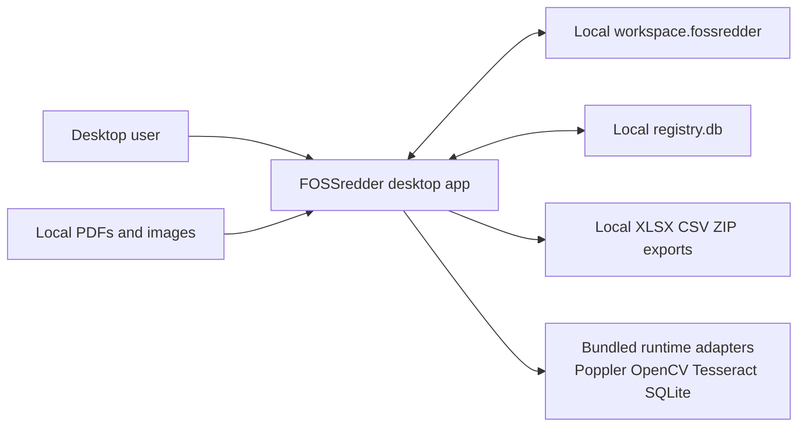
```mermaid
flowchart LR
  User["Desktop user"]
  Docs["Local PDFs and images"]
  Workspace["Local workspace.fossredder"]
  Registry["Local registry.db"]
  Exports["Local XLSX CSV ZIP exports"]
  App["FOSSredder desktop app"]
  Runtime["Bundled runtime adapters<br/>Poppler OpenCV Tesseract SQLite"]

  User --> App
  Docs --> App
  App <--> Workspace
  App <--> Registry
  App --> Exports
  App --> Runtime
```

## 3. Architecture Design <a id="3-architecture-design"></a>

FOSSredder is structured around [Clean Architecture](#glossary-clean-architecture)
layers that are implemented as CMake targets:

- `app` builds the `fossredder` executable and acts as the [composition root](#glossary-composition-root).
- `ui` owns QML modules, view models, workflows, UI adapters, and shell wiring.
- `core` owns domain types, use-case services, workspace/session orchestration,
  jobs, policies, DTOs, and all public ports.
- `persistence` implements SQLite-backed storage, repository, registry, and
  workspace state persistence.
- `infra/*` implements external-library adapters for rendering, image
  processing, OCR, export, archive, and analysis-image rendering.
- `diagnostics` implements diagnostic sinks and the default error reporter.

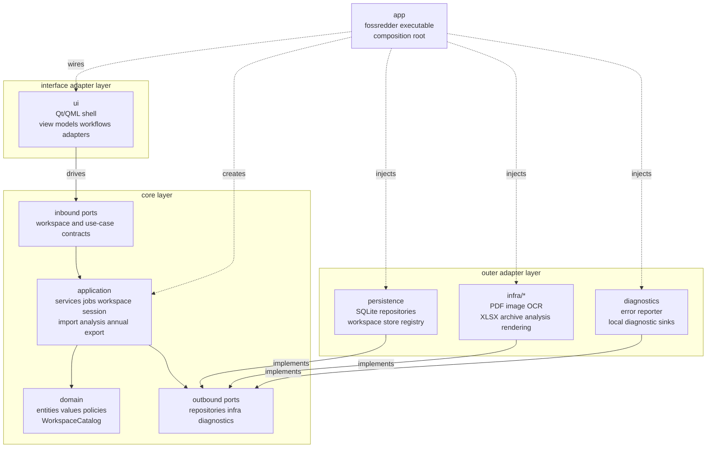
```mermaid
flowchart TB
  App["app<br/>fossredder executable<br/>composition root"]

  subgraph InterfaceLayer["interface adapter layer"]
    direction TB
    UI["ui<br/>Qt/QML shell<br/>view models workflows adapters"]
  end

  subgraph CoreLayer["core layer"]
    direction TB
    InboundPorts["inbound ports<br/>workspace and use-case contracts"]
    Application["application<br/>services jobs workspace session<br/>import analysis annual export"]
    Domain["domain<br/>entities values policies<br/>WorkspaceCatalog"]
    OutboundPorts["outbound ports<br/>repositories infra diagnostics"]

    InboundPorts --> Application
    Application --> Domain
    Application --> OutboundPorts
  end

  subgraph AdapterLayer["outer adapter layer"]
    direction TB
    Persistence["persistence<br/>SQLite repositories<br/>workspace store registry"]
    Infra["infra/*<br/>PDF image OCR<br/>XLSX archive analysis rendering"]
    Diagnostics["diagnostics<br/>error reporter<br/>local diagnostic sinks"]
  end

  UI -->|drives| InboundPorts
  Persistence -->|implements| OutboundPorts
  Infra -->|implements| OutboundPorts
  Diagnostics -->|implements| OutboundPorts

  App -. wires .-> UI
  App -. creates .-> Application
  App -. injects .-> Persistence
  App -. injects .-> Infra
  App -. injects .-> Diagnostics
```

### 3.1 Runtime Composition

Startup wiring happens in `app/src/main.cpp` and `app/src/main_qml.cpp`.
`app` creates the workspace facade, registers SQLite load/save functions,
constructs use-case runners and injects the concrete persistence,
infrastructure and diagnostics adapters.

At runtime, the dependency flow is:

1. QML sends user intent into `ui` view models and workflows.
2. UI workflows translate UI state into workspace commands or use-case requests.
3. `core` services execute domain rules against snapshots and ports.
4. Concrete adapters perform local I/O or third-party-library work.
5. Results flow back as DTOs, snapshots, progress events or diagnostics.

### 3.2 Layer Ownership

Layer ownership is intentionally narrow:

| Layer | Owns | Must not own |
|---|---|---|
| `core/domain` | Entities, value objects, invariants and reusable policies. | UI state, persistence details or workflow DTO storage. |
| `core/application` | Use-case orchestration, workspace services, imports, exports, analysis and annual workflows. | Qt/QML bindings or concrete third-party libraries. |
| `core/ports` | Public contracts for use cases, workspace access, persistence and infrastructure capabilities. | Concrete implementations. |
| `persistence` | SQLite schema, repositories, registry and workspace state storage. | Domain rules or UI projections. |
| `infra/*` | Concrete adapters for PDF rendering, image processing, OCR, archive and XLSX output. | Product workflows or UI decisions. |
| `ui/src` and `ui/include/ui` | QML-facing state, view models, workflows, adapters, selectors and payload mapping. | Domain invariants, persistence decisions or duplicated business rules. |
| `ui/qml` | Declarative composition, binding, layout, controls and user intent. | Core logic, workflow decisions or data transformation. |

Refactors should preserve behavior unless the issue explicitly changes it, stay
inside the owning layer, and remove dead wrappers or stale compatibility paths
instead of moving them. Search C++, QML and tests before renaming public API.
Create shared helpers only when they represent a stable project concept, not
just a few repeated lines.

## 4. Core <a id="4-core"></a>

The `core` target is the inner boundary of FOSSredder. It owns the domain
language, application use cases and [ports](#glossary-port)
that connect the desktop UI, persistence and
[infrastructure adapters](#glossary-adapter).

- `domain` contains the durable workspace model and its rules.
- `application` orchestrates workspace, import, analysis, annual, export and
  storage use cases.
- `ports` define the contracts used by UI, persistence, infrastructure and
  diagnostics.

Core code stays independent of Qt, SQLite, Poppler, OpenCV, Tesseract, xlnt and
Inno Setup. Supporting packages such as `core/errors`, `core/jobs` and
`core/utils` may support the core, but they should not own business workflows.

### 4.1 Domain

#### 4.1.1 Entities

Entities are identity-bearing objects owned by `WorkspaceCatalog`. They keep
durable ids and relationship ids, while changes go through domain behavior such
as renaming, assignment, status transitions and ordered relation updates.

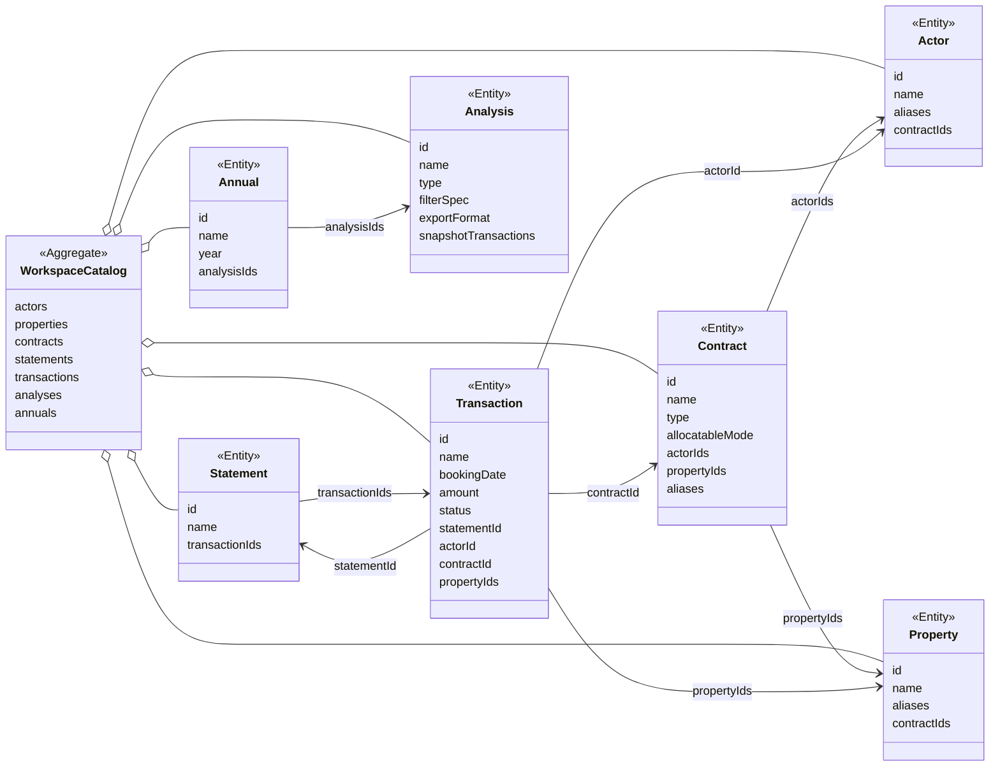
```mermaid
classDiagram
    direction LR

    class WorkspaceCatalog {
        <<Aggregate>>
        actors
        properties
        contracts
        statements
        transactions
        analyses
        annuals
    }

    class Actor {
        <<Entity>>
        id
        name
        aliases
        contractIds
    }

    class Property {
        <<Entity>>
        id
        name
        aliases
        contractIds
    }

    class Contract {
        <<Entity>>
        id
        name
        type
        allocatableMode
        actorIds
        propertyIds
        aliases
    }

    class Statement {
        <<Entity>>
        id
        name
        transactionIds
    }

    class Transaction {
        <<Entity>>
        id
        name
        bookingDate
        amount
        status
        statementId
        actorId
        contractId
        propertyIds
    }

    class Analysis {
        <<Entity>>
        id
        name
        type
        filterSpec
        exportFormat
        snapshotTransactions
    }

    class Annual {
        <<Entity>>
        id
        name
        year
        analysisIds
    }

    WorkspaceCatalog o-- Actor
    WorkspaceCatalog o-- Property
    WorkspaceCatalog o-- Contract
    WorkspaceCatalog o-- Statement
    WorkspaceCatalog o-- Transaction
    WorkspaceCatalog o-- Analysis
    WorkspaceCatalog o-- Annual

    Contract --> Actor : actorIds
    Contract --> Property : propertyIds
    Statement --> Transaction : transactionIds
    Transaction --> Statement : statementId
    Transaction --> Actor : actorId
    Transaction --> Contract : contractId
    Transaction --> Property : propertyIds
    Annual --> Analysis : analysisIds
```

#### 4.1.2 Values

Values wrap small domain concepts that need normalization or validation before
entities store them. They keep names, aliases, contract types, dates, amounts,
analysis types, export formats, filter specs and years out of raw string
handling.

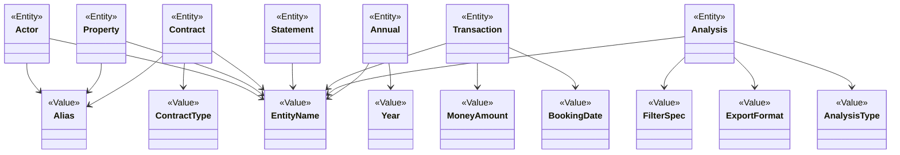
```mermaid
classDiagram
    direction TB

    class Actor {
        <<Entity>>
    }
    class Property {
        <<Entity>>
    }
    class Contract {
        <<Entity>>
    }
    class Statement {
        <<Entity>>
    }
    class Transaction {
        <<Entity>>
    }
    class Analysis {
        <<Entity>>
    }
    class Annual {
        <<Entity>>
    }

    class EntityName {
        <<Value>>
    }
    class Alias {
        <<Value>>
    }
    class ContractType {
        <<Value>>
    }
    class BookingDate {
        <<Value>>
    }
    class MoneyAmount {
        <<Value>>
    }
    class AnalysisType {
        <<Value>>
    }
    class ExportFormat {
        <<Value>>
    }
    class FilterSpec {
        <<Value>>
    }
    class Year {
        <<Value>>
    }

    Actor --> EntityName
    Property --> EntityName
    Contract --> EntityName
    Statement --> EntityName
    Transaction --> EntityName
    Analysis --> EntityName
    Annual --> EntityName
    Actor --> Alias
    Property --> Alias
    Contract --> Alias
    Contract --> ContractType
    Transaction --> BookingDate
    Transaction --> MoneyAmount
    Analysis --> AnalysisType
    Analysis --> ExportFormat
    Analysis --> FilterSpec
    Annual --> Year
```

#### 4.1.3 Policies

Policies are stateless domain modules for rules shared across entities and
application services. They cover alias normalization, transaction and statement
validation, analysis and annual consistency, and draft-matching signals.

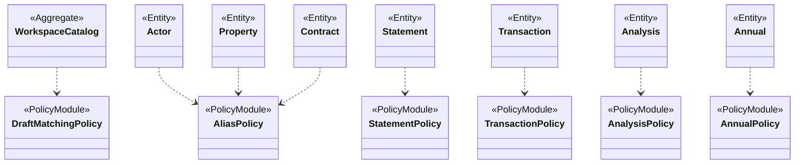
```mermaid
classDiagram
    direction TB

    class WorkspaceCatalog {
        <<Aggregate>>
    }
    class Actor {
        <<Entity>>
    }
    class Property {
        <<Entity>>
    }
    class Contract {
        <<Entity>>
    }
    class Statement {
        <<Entity>>
    }
    class Transaction {
        <<Entity>>
    }
    class Analysis {
        <<Entity>>
    }
    class Annual {
        <<Entity>>
    }

    class AliasPolicy {
        <<PolicyModule>>
    }
    class TransactionPolicy {
        <<PolicyModule>>
    }
    class StatementPolicy {
        <<PolicyModule>>
    }
    class AnalysisPolicy {
        <<PolicyModule>>
    }
    class AnnualPolicy {
        <<PolicyModule>>
    }
    class DraftMatchingPolicy {
        <<PolicyModule>>
    }

    Actor ..> AliasPolicy
    Property ..> AliasPolicy
    Contract ..> AliasPolicy
    Transaction ..> TransactionPolicy
    Statement ..> StatementPolicy
    Analysis ..> AnalysisPolicy
    Annual ..> AnnualPolicy
    WorkspaceCatalog ..> DraftMatchingPolicy
```

### 4.2 Application

#### 4.2.1 Workspace

Workspace access is the UI-facing command and query boundary. The facade
delegates mutations to command and workflow services, reads through the query
service and returns immutable snapshots instead of exposing mutable domain
objects.

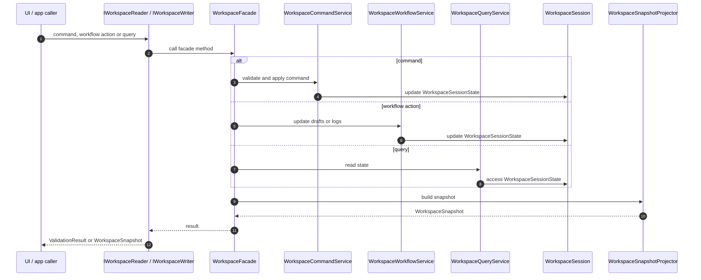
```mermaid
sequenceDiagram
  autonumber
  participant UI as UI / app caller
  participant Boundary as IWorkspaceReader / IWorkspaceWriter
  participant Facade as WorkspaceFacade
  participant Commands as WorkspaceCommandService
  participant Workflows as WorkspaceWorkflowService
  participant Queries as WorkspaceQueryService
  participant Session as WorkspaceSession
  participant Projector as WorkspaceSnapshotProjector

  UI->>Boundary: command, workflow action or query
  Boundary->>Facade: call facade method
  alt command
    Facade->>Commands: validate and apply command
    Commands->>Session: update WorkspaceSessionState
  else workflow action
    Facade->>Workflows: update drafts or logs
    Workflows->>Session: update WorkspaceSessionState
  else query
    Facade->>Queries: read state
    Queries->>Session: access WorkspaceSessionState
  end
  Facade->>Projector: build snapshot
  Projector-->>Facade: WorkspaceSnapshot
  Facade-->>Boundary: result
  Boundary-->>UI: ValidationResult or WorkspaceSnapshot
```

#### 4.2.2 Import

Import is asynchronous and event-driven. The runner and job system own lifecycle
and progress, document-processing ports provide render, image and OCR data, and
drafts are matched before the workspace boundary keeps, edits or finalizes them.

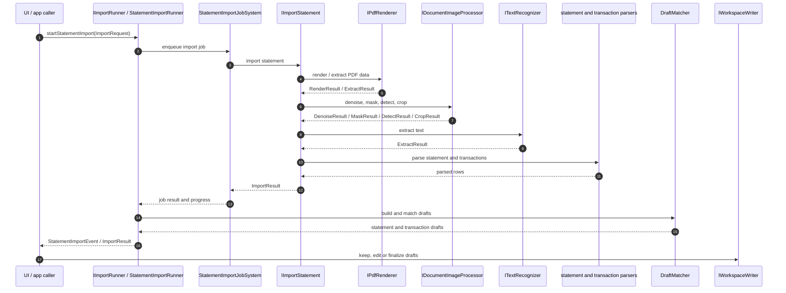
```mermaid
sequenceDiagram
  autonumber
  participant UI as UI / app caller
  participant Runner as IImportRunner / StatementImportRunner
  participant Jobs as StatementImportJobSystem
  participant Importer as IImportStatement
  participant Pdf as IPdfRenderer
  participant Image as IDocumentImageProcessor
  participant Ocr as ITextRecognizer
  participant Parser as statement and transaction parsers
  participant Matcher as DraftMatcher
  participant Writer as IWorkspaceWriter

  UI->>Runner: startStatementImport(ImportRequest)
  Runner->>Jobs: enqueue import job
  Jobs->>Importer: import statement
  Importer->>Pdf: render / extract PDF data
  Pdf-->>Importer: RenderResult / ExtractResult
  Importer->>Image: denoise, mask, detect, crop
  Image-->>Importer: DenoiseResult / MaskResult / DetectResult / CropResult
  Importer->>Ocr: extract text
  Ocr-->>Importer: ExtractResult
  Importer->>Parser: parse statement and transactions
  Parser-->>Importer: parsed rows
  Importer-->>Jobs: ImportResult
  Jobs-->>Runner: job result and progress
  Runner->>Matcher: build and match drafts
  Matcher-->>Runner: statement and transaction drafts
  Runner-->>UI: StatementImportEvent / ImportResult
  UI->>Writer: keep, edit or finalize drafts
```

#### 4.2.3 Analysis

Analysis is snapshot-based computation. The service resolves the request,
applies filters, computes table or plot results and can render artifacts without
mutating workspace state.

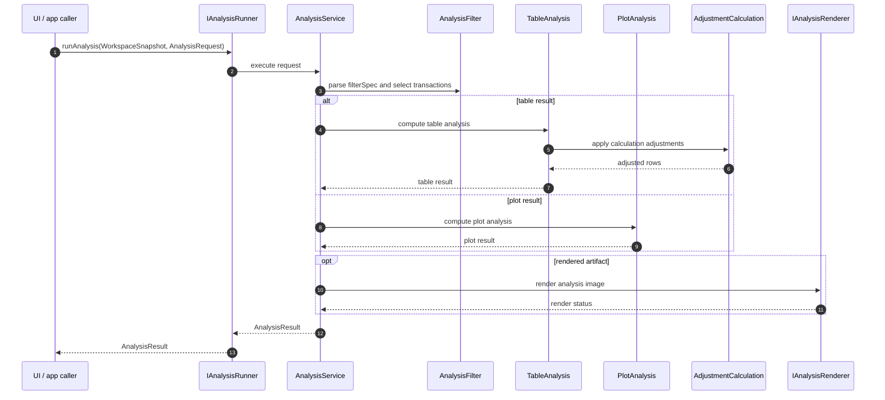
```mermaid
sequenceDiagram
  autonumber
  participant UI as UI / app caller
  participant Runner as IAnalysisRunner
  participant Service as AnalysisService
  participant Filter as AnalysisFilter
  participant Table as TableAnalysis
  participant Plot as PlotAnalysis
  participant Adjustments as AdjustmentCalculation
  participant Renderer as IAnalysisRenderer

  UI->>Runner: runAnalysis(WorkspaceSnapshot, AnalysisRequest)
  Runner->>Service: execute request
  Service->>Filter: parse filterSpec and select transactions
  alt table result
    Service->>Table: compute table analysis
    Table->>Adjustments: apply calculation adjustments
    Adjustments-->>Table: adjusted rows
    Table-->>Service: table result
  else plot result
    Service->>Plot: compute plot analysis
    Plot-->>Service: plot result
  end
  opt rendered artifact
    Service->>Renderer: render analysis image
    Renderer-->>Service: render status
  end
  Service-->>Runner: AnalysisResult
  Runner-->>UI: AnalysisResult
```

#### 4.2.4 Annual

Annual builds a year-specific report from one annual definition, linked analyses
and workspace transactions. It returns report result DTOs instead of storing
report output directly in the domain.

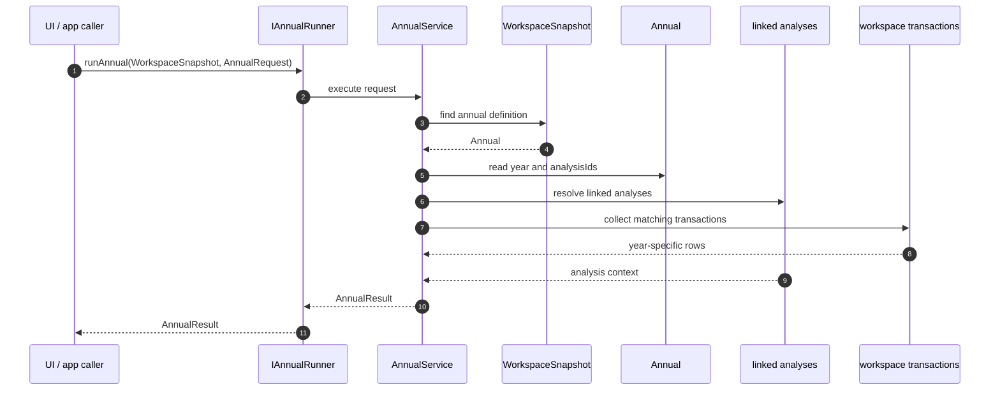
```mermaid
sequenceDiagram
  autonumber
  participant UI as UI / app caller
  participant Runner as IAnnualRunner
  participant Service as AnnualService
  participant Snapshot as WorkspaceSnapshot
  participant Annual as Annual
  participant Analyses as linked analyses
  participant Transactions as workspace transactions

  UI->>Runner: runAnnual(WorkspaceSnapshot, AnnualRequest)
  Runner->>Service: execute request
  Service->>Snapshot: find annual definition
  Snapshot-->>Service: Annual
  Service->>Annual: read year and analysisIds
  Service->>Analyses: resolve linked analyses
  Service->>Transactions: collect matching transactions
  Transactions-->>Service: year-specific rows
  Analyses-->>Service: analysis context
  Service-->>Runner: AnnualResult
  Runner-->>UI: AnnualResult
```

#### 4.2.5 Export

Export dispatches workspace, analysis or annual output to the requested file
shape. File generation stays behind writer, renderer and archive ports so the
use case can stay independent of concrete libraries.

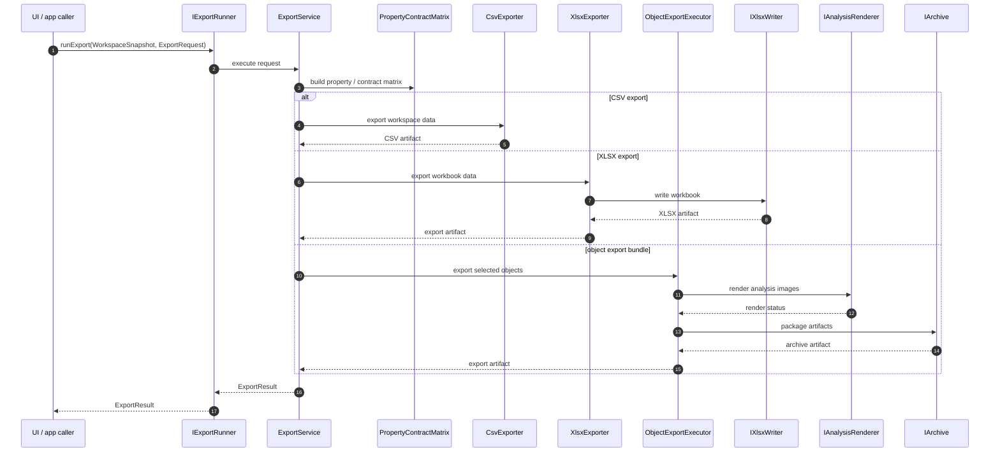
```mermaid
sequenceDiagram
  autonumber
  participant UI as UI / app caller
  participant Runner as IExportRunner
  participant Service as ExportService
  participant Matrix as PropertyContractMatrix
  participant Csv as CsvExporter
  participant Xlsx as XlsxExporter
  participant ObjectExport as ObjectExportExecutor
  participant XlsxPort as IXlsxWriter
  participant ImagePort as IAnalysisRenderer
  participant ArchivePort as IArchive

  UI->>Runner: runExport(WorkspaceSnapshot, ExportRequest)
  Runner->>Service: execute request
  Service->>Matrix: build property / contract matrix
  alt CSV export
    Service->>Csv: export workspace data
    Csv-->>Service: CSV artifact
  else XLSX export
    Service->>Xlsx: export workbook data
    Xlsx->>XlsxPort: write workbook
    XlsxPort-->>Xlsx: XLSX artifact
    Xlsx-->>Service: export artifact
  else object export bundle
    Service->>ObjectExport: export selected objects
    ObjectExport->>ImagePort: render analysis images
    ImagePort-->>ObjectExport: render status
    ObjectExport->>ArchivePort: package artifacts
    ArchivePort-->>ObjectExport: archive artifact
    ObjectExport-->>Service: export artifact
  end
  Service-->>Runner: ExportResult
  Runner-->>UI: ExportResult
```

#### 4.2.6 Storage

Storage coordinates workspace file paths and persistence callbacks at the
application boundary. `StorageManager` owns registry interaction and delegates
atomic load/save work to callbacks wired by the composition root.

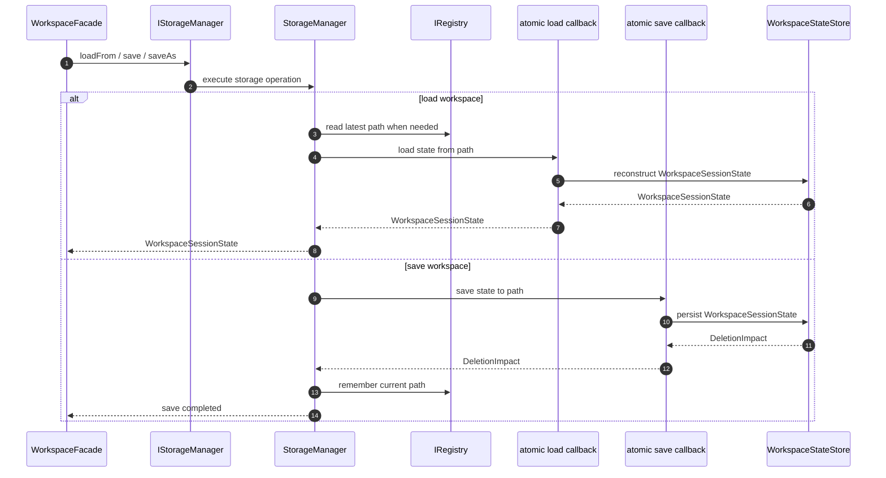
```mermaid
sequenceDiagram
  autonumber
  participant Facade as WorkspaceFacade
  participant Port as IStorageManager
  participant Storage as StorageManager
  participant Registry as IRegistry
  participant Load as atomic load callback
  participant Save as atomic save callback
  participant Store as WorkspaceStateStore

  Facade->>Port: loadFrom / save / saveAs
  Port->>Storage: execute storage operation
  alt load workspace
    Storage->>Registry: read latest path when needed
    Storage->>Load: load state from path
    Load->>Store: reconstruct WorkspaceSessionState
    Store-->>Load: WorkspaceSessionState
    Load-->>Storage: WorkspaceSessionState
    Storage-->>Facade: WorkspaceSessionState
  else save workspace
    Storage->>Save: save state to path
    Save->>Store: persist WorkspaceSessionState
    Store-->>Save: DeletionImpact
    Save-->>Storage: DeletionImpact
    Storage->>Registry: remember current path
    Storage-->>Facade: save completed
  end
```

### 4.3 Ports

Ports define the contracts at the core boundary. A port folder should keep the
callable interface, request DTOs, result DTOs and shared types next to each
other when the contract has structured input or output. This keeps boundary
shape visible without opening the implementation.

- `Workspace` ports are the UI-facing workspace boundary. The reader and writer
  interfaces expose facade access, command DTOs carry user intent and snapshot
  DTOs return immutable workspace state.
- `Use-case` ports cover import, analysis, annual and export workflows. A use
  case exposes a runner interface, a request type and a result type. Async
  workflows also expose handle and event types.
- `Infrastructure` ports define adapter contracts for PDF rendering, document
  image processing, OCR, XLSX writing, analysis rendering, archives and storage.
  Adapter ports should keep interface, request, result and types headers
  together in the adapter folder.
- `Repository` ports are persistence-facing interfaces for catalog entities,
  drafts and import/export logs. They let persistence reconstruct and save
  workspace state without exposing SQLite to the core.
- `Diagnostics` ports provide error reporting and diagnostic output contracts used
  by jobs and workflows.

## 5. Infrastructure <a id="5-infrastructure"></a>
### 5.1 Persistence

Persistence is implemented by the SQLite-backed `persistence` target. The workspace
database stores catalog data, workflow drafts, analyses, annual definitions,
import logs and export logs. The registry database stores startup metadata such
as the last opened workspace path.

`StorageManager` coordinates workspace paths and load/save callbacks in the core
application layer. The concrete SQLite store is wired in `app/src/main.cpp` and
persists a complete `WorkspaceSessionState` in one transactional save operation.

Implementation roles:

- `WorkspaceStateStore` loads and saves complete workspace state.
- `SqliteDb` owns connection setup, schema initialization and shared statement
  execution.
- `SqliteSchema` creates tables, indices, foreign keys and migration metadata.
- `SqliteTransaction` wraps transactional writes.
- `SqliteRegistry` stores the latest-workspace registry.
- SQLite [repositories](#glossary-repository) map persisted
  rows to core models.


```mermaid
erDiagram
    %% Catalog
    ACTORS {
        TEXT id PK
        TEXT name
    }

    ACTOR_ALIASES {
        TEXT actor_id PK
        TEXT alias PK
    }

    PROPERTIES {
        TEXT id PK
        TEXT name
    }

    PROPERTY_ALIASES {
        TEXT property_id PK
        TEXT alias PK
    }

    CONTRACTS {
        TEXT id PK
        TEXT name
        TEXT type
    }

    CONTRACT_ALIASES {
        TEXT contract_id PK
        TEXT alias PK
    }

    CONTRACT_ACTORS {
        TEXT contract_id PK
        TEXT actor_id PK
    }

    CONTRACT_PROPERTIES {
        TEXT contract_id PK
        TEXT property_id PK
    }

    ACTORS ||--o{ ACTOR_ALIASES : aliases
    PROPERTIES ||--o{ PROPERTY_ALIASES : aliases
    CONTRACTS ||--o{ CONTRACT_ALIASES : aliases
    CONTRACTS ||--o{ CONTRACT_ACTORS : actors
    ACTORS ||--o{ CONTRACT_ACTORS : contracts
    CONTRACTS ||--o{ CONTRACT_PROPERTIES : properties
    PROPERTIES ||--o{ CONTRACT_PROPERTIES : contracts

    %% Posted statements
    STATEMENTS {
        TEXT id PK
        TEXT name
    }

    TRANSACTIONS {
        TEXT id PK
        TEXT statement_id FK
        INTEGER status
        TEXT actor_id FK
        TEXT contract_id FK
    }

    STATEMENT_TRANSACTIONS {
        TEXT statement_id PK
        TEXT transaction_id PK
        INTEGER position
    }

    TRANSACTION_PROPERTIES {
        TEXT transaction_id PK
        TEXT property_id PK
    }

    STATEMENTS ||--o{ TRANSACTIONS : owns
    STATEMENTS ||--o{ STATEMENT_TRANSACTIONS : order
    TRANSACTIONS ||--o{ STATEMENT_TRANSACTIONS : member
    ACTORS ||--o{ TRANSACTIONS : actor
    CONTRACTS ||--o{ TRANSACTIONS : contract
    TRANSACTIONS ||--o{ TRANSACTION_PROPERTIES : properties
    PROPERTIES ||--o{ TRANSACTION_PROPERTIES : transactions

    %% Import drafts
    STATEMENT_DRAFTS {
        TEXT id PK
        TEXT name
    }

    TRANSACTION_DRAFTS {
        TEXT id PK
        TEXT statement_draft_id FK
        INTEGER position
        TEXT actor_id
        TEXT contract_id
        INTEGER status
    }

    STATEMENT_DRAFT_TRANSACTIONS {
        TEXT statement_draft_id PK
        TEXT transaction_draft_id PK
        INTEGER position
    }

    TRANSACTION_DRAFT_PROPERTIES {
        TEXT transaction_draft_id PK
        INTEGER property_position PK
        TEXT property_id
    }

    IMPORT_LOGS {
        TEXT id PK
        TEXT time
        TEXT type
        TEXT status
    }

    IMPORT_LOG_STATEMENT_DRAFTS {
        TEXT import_log_id PK
        TEXT statement_draft_id PK
        INTEGER position
    }

    STATEMENT_DRAFTS ||--o{ TRANSACTION_DRAFTS : owns
    STATEMENT_DRAFTS ||--o{ STATEMENT_DRAFT_TRANSACTIONS : order
    TRANSACTION_DRAFTS ||--o{ STATEMENT_DRAFT_TRANSACTIONS : member
    TRANSACTION_DRAFTS ||--o{ TRANSACTION_DRAFT_PROPERTIES : properties
    IMPORT_LOGS ||--o{ IMPORT_LOG_STATEMENT_DRAFTS : drafts
    STATEMENT_DRAFTS ||--o{ IMPORT_LOG_STATEMENT_DRAFTS : logs

    %% Reporting and export
    ANALYSES {
        TEXT id PK
        TEXT name
        TEXT type
    }

    ANALYSIS_ADJUSTMENTS {
        TEXT analysis_id PK
        TEXT adjustment_key PK
        INTEGER position
    }

    ANNUALS {
        TEXT id PK
        TEXT name
        INTEGER year
    }

    ANNUAL_ANALYSES {
        TEXT annual_id PK
        TEXT analysis_id PK
        INTEGER position
    }

    EXPORT_LOGS {
        TEXT id PK
        TEXT time
        TEXT target_path
        TEXT status
    }

    EXPORT_LOG_ANNUALS {
        TEXT export_log_id PK
        TEXT annual_id PK
        INTEGER position
    }

    EXPORT_LOG_ANALYSES {
        TEXT export_log_id PK
        TEXT analysis_id PK
        INTEGER position
    }

    ANALYSES ||--o{ ANALYSIS_ADJUSTMENTS : adjustments
    ANNUALS ||--o{ ANNUAL_ANALYSES : analyses
    ANALYSES ||--o{ ANNUAL_ANALYSES : annuals
    EXPORT_LOGS ||--o{ EXPORT_LOG_ANNUALS : annuals
    ANNUALS ||--o{ EXPORT_LOG_ANNUALS : export_logs
    EXPORT_LOGS ||--o{ EXPORT_LOG_ANALYSES : analyses
    ANALYSES ||--o{ EXPORT_LOG_ANALYSES : export_logs
```

### 5.2 Third-Party Integration

Third-party libraries are isolated in focused `infra/*` targets. Core use cases
depend on ports and request/result DTOs. Infrastructure adapters translate those
contracts to Poppler, OpenCV, Tesseract, xlnt, libzip and related library calls.

The infrastructure structure follows a stable pattern:

- Each `infra/*` target owns one external capability, such as PDF rendering, OCR,
  document image processing, XLSX writing, archive creation or analysis
  rendering.
- Target names describe the capability: `pdf-rendering`, `text-recognition`,
  `document-image-processing`, `xlsx-writer`, `archive` and
  `analysis-rendering`.
- Adapter implementations translate at the port boundary. Library types,
  initialization details and library-specific errors stay outside `core` and
  `ui`.

### 5.3 Concurrency

Background job ownership belongs to the core application flow. Infrastructure
adapters execute bounded work requested through ports, such as PDF rendering,
image processing, OCR, XLSX writing or archive creation.

Long-running port requests may carry a shared cancellation flag. Adapters check
that flag before and during expensive work and return the port-level canceled
result where the contract defines one. Workflow state, retry policy and job
ownership remain in core application services.

### 5.4 Diagnostics

Diagnostics are exposed through core-owned ports. `IErrorReporter` carries
structured runtime errors, while `IDiagnostics` writes optional text or binary
artifacts for local debugging.

The `diagnostics` target provides the default implementations for these ports,
including file-backed diagnostics, spdlog-backed diagnostics and the default
error reporter.

The composition root passes concrete diagnostics sinks into infrastructure and
application workflows. The default error reporter writes through
`SpdlogDiagnostics` with a file diagnostics backend. Import adapters receive a
separate `FileDiagnostics` sink for local import artifacts.

Infrastructure code reports library failures and optional artifacts through
these port boundaries. Import evidence that the UI needs, such as proof images
or derived proof sources, remains part of import results, draft state or
workspace snapshots instead of being treated only as diagnostic output.

## 6. User Interface <a id="6-user-interface"></a>

### 6.1 Architecture

The UI follows an [MVVM](#glossary-mvvm)-oriented
presentation boundary. QML composes views and emits user intent, view models
expose QML-facing `QObject` APIs, and UI-side workspace roles, workflows and
adapters translate between presentation state and core ports.

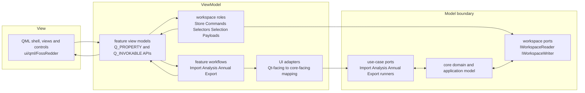
```mermaid
flowchart LR
  subgraph View["View"]
    direction TB
    QmlViews["QML shell, views and controls<br/>ui/qml/FossRedder"]
  end

  subgraph ViewModel["ViewModel"]
    direction TB
    FeatureVms["feature view models<br/>Q_PROPERTY and Q_INVOKABLE APIs"]
    UiWorkflows["feature workflows<br/>Import Analysis Annual Export"]
    UiAdapters["UI adapters<br/>Qt-facing to core-facing mapping"]
    WorkspaceRoles["workspace roles<br/>Store Commands Selectors Selection Payloads"]
  end

  subgraph Model["Model boundary"]
    direction TB
    UseCasePorts["use-case ports<br/>Import Analysis Annual Export runners"]
    CoreModel["core domain and application model"]
    WorkspacePorts["workspace ports<br/>IWorkspaceReader IWorkspaceWriter"]
  end

  QmlViews --> FeatureVms
  FeatureVms --> UiWorkflows
  UiWorkflows --> UiAdapters
  UiAdapters --> UseCasePorts
  FeatureVms --> WorkspaceRoles
  WorkspaceRoles --> WorkspacePorts
  UseCasePorts <--> CoreModel
  CoreModel <--> WorkspacePorts
  WorkspaceRoles --> FeatureVms
  UiWorkflows --> FeatureVms
  FeatureVms --> QmlViews
```

View models hold presentation state such as selected ids, form values, dirty
state, expanded state and button enablement. They expose values QML can bind and
operations QML can invoke, but business behavior remains behind workspace ports
and use-case ports.

### 6.2 Composition

UI composition starts in `app/src/main_qml.cpp`. The app creates `MainWindow`,
wires workspace callbacks, calls `ui::shell::createComposition` and starts the
Qt event loop. `MainWindow` owns the QML runtime, shell objects, workspace roles
and the `AppContext` object exposed to QML.

`ui::shell::createComposition` creates feature view models, workflows, adapters
and platform services, then attaches them to `AppContext`. `AppContext` is the
stable QML access point for actions, navigation, status, platform services,
feature view models, the language service and the debug-build flag.

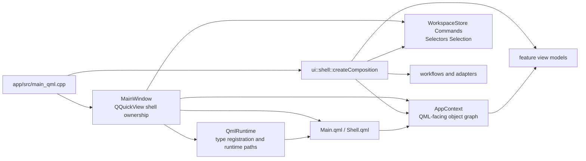
```mermaid
flowchart LR
  App["app/src/main_qml.cpp"]
  MainWindow["MainWindow<br/>QQuickView shell ownership"]
  QmlRuntime["QmlRuntime<br/>type registration and runtime paths"]
  Composition["ui::shell::createComposition"]
  AppContext["AppContext<br/>QML-facing object graph"]
  WorkspaceRoles["WorkspaceStore Commands<br/>Selectors Selection"]
  ViewModels["feature view models"]
  Workflows["workflows and adapters"]
  QML["Main.qml / Shell.qml"]

  App --> MainWindow
  App --> Composition
  MainWindow --> QmlRuntime
  MainWindow --> AppContext
  MainWindow --> WorkspaceRoles
  MainWindow --> QML
  Composition --> WorkspaceRoles
  Composition --> ViewModels
  Composition --> Workflows
  Composition --> AppContext
  QmlRuntime --> QML
  QML --> AppContext
  AppContext --> ViewModels
```

Only app-wide services that are used across feature areas belong in
`AppContext`. Feature-specific state stays inside the owning view model or
workflow. Navigation values stay stable through `QmlContracts` and `Navigation`.

### 6.3 QML Modules

The root QML module is `FossRedder 1.0`. `Main.qml` creates
`Components.Shell` and passes the provided `AppContext` and `Theme` singletons
into it.

`Components` contains shell-level composition such as the app menu, toolbar,
routers and status bar. `Controls` contains reusable project controls.
`Views/*` contains feature screens for actors, properties, contracts, booking,
import, analysis, annual reports, export and settings. `Theme` owns shared
presentation tokens, and `Assets` contains navigation and feature icons.

The shell uses `SidebarRouter.qml` and `ContentRouter.qml` to select the active
feature view from `Navigation`. Feature views receive only the view models and
theme data they need.

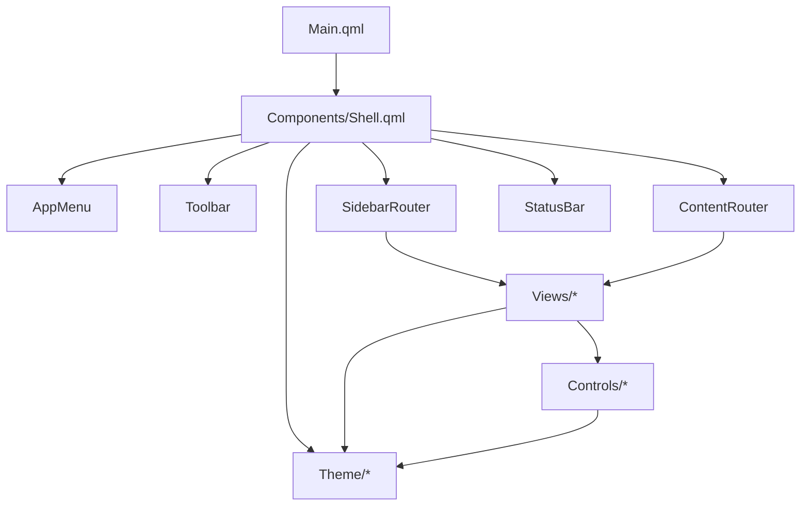
```mermaid
flowchart TB
  Main["Main.qml"]
  Shell["Components/Shell.qml"]
  AppMenu["AppMenu"]
  Toolbar["Toolbar"]
  SidebarRouter["SidebarRouter"]
  ContentRouter["ContentRouter"]
  StatusBar["StatusBar"]
  Views["Views/*"]
  Controls["Controls/*"]
  Theme["Theme/*"]

  Main --> Shell
  Shell --> AppMenu
  Shell --> Toolbar
  Shell --> SidebarRouter
  Shell --> ContentRouter
  Shell --> StatusBar
  SidebarRouter --> Views
  ContentRouter --> Views
  Views --> Controls
  Shell --> Theme
  Views --> Theme
  Controls --> Theme
```

QML remains declarative: compose UI, bind state and emit user intent. Feature
screens live under `ui/qml/FossRedder/Views/<Feature>/`, and shared `Controls`,
`Components` and `Theme` values should be preferred over one-off visual code.

### 6.4 Workspace Boundary

The UI consumes `WorkspaceSnapshot` data and submits typed commands through the
core workspace ports. `WorkspaceStore` owns the current UI-side snapshot and
revision lifecycle. `WorkspaceCommands` maps UI intent to writer commands,
`WorkspaceSelectors` and `WorkspacePayloads` project snapshot data for QML, and
`WorkspaceSelection` tracks selected entity ids across views.

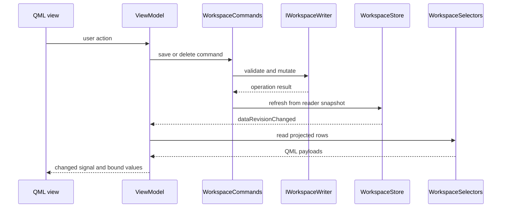
```mermaid
sequenceDiagram
    participant QML as QML view
    participant VM as ViewModel
    participant Commands as WorkspaceCommands
    participant Writer as IWorkspaceWriter
    participant Store as WorkspaceStore
    participant Selectors as WorkspaceSelectors

    QML->>VM: user action
    VM->>Commands: save or delete command
    Commands->>Writer: validate and mutate
    Writer-->>Commands: operation result
    Commands->>Store: refresh from reader snapshot
    Store-->>VM: dataRevisionChanged
    VM->>Selectors: read projected rows
    Selectors-->>VM: QML payloads
    VM-->>QML: changed signal and bound values
```

Deletion impact follows the same boundary. The core workspace writer reports the
impact through the callback registered in `wireWorkspaceCallbacks`,
`WorkspaceStore` applies it to the UI snapshot, `WorkspaceSelection` validates
current selections, and view models notify QML through their public API.

### 6.5 Feature Workflows

Simple catalog and booking screens stop at `WorkspaceCommands` because they only
read snapshots and submit workspace mutations. Import, analysis, annual and
export use workflows and adapters because they coordinate multi-step state,
progress, cancellation or use-case runners.

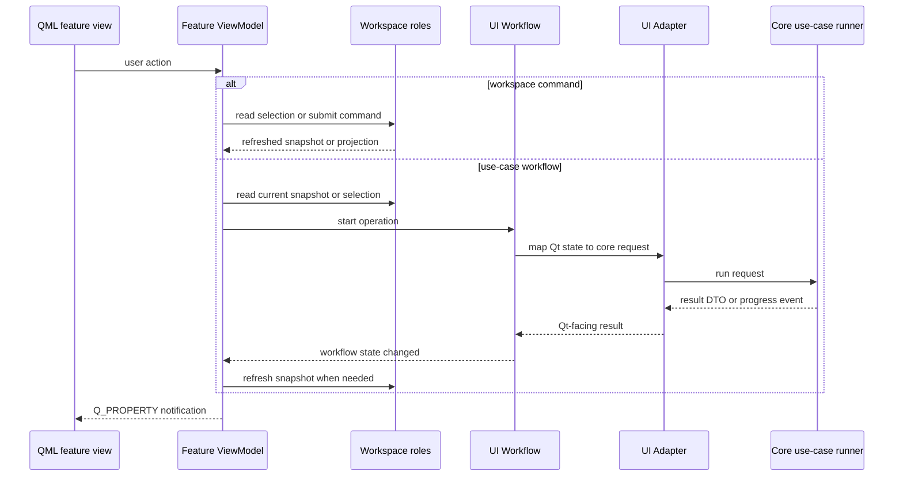
```mermaid
sequenceDiagram
    participant View as QML feature view
    participant VM as Feature ViewModel
    participant Workspace as Workspace roles
    participant Workflow as UI Workflow
    participant Adapter as UI Adapter
    participant Runner as Core use-case runner

    View->>VM: user action
    alt workspace command
        VM->>Workspace: read selection or submit command
        Workspace-->>VM: refreshed snapshot or projection
    else use-case workflow
        VM->>Workspace: read current snapshot or selection
        VM->>Workflow: start operation
        Workflow->>Adapter: map Qt state to core request
        Adapter->>Runner: run request
        Runner-->>Adapter: result DTO or progress event
        Adapter-->>Workflow: Qt-facing result
        Workflow-->>VM: workflow state changed
        VM->>Workspace: refresh snapshot when needed
    end
    VM-->>View: Q_PROPERTY notification
```

Workflows may hold in-memory UI session state, such as active import drafts or
running export state. Adapters stay thin: they map payloads, delegate to core
ports and bridge progress or cancellation. Before storage save, the active
import draft is flushed through the callback installed by `createComposition`.

### 6.6 Platform Services

Platform services keep native desktop integration out of feature view models.
`FileDialogs` owns native dialogs for import, export and workspace paths.
`FileSystemBrowser` provides QML-facing file and directory browsing.
`LanguageService` handles translation discovery and runtime language switching.
`Settings` stores UI preferences such as theme mode, autosave, import defaults,
export defaults and toolbar visibility.

### 6.7 UI Diagnostics

UI diagnostics extend the diagnostics boundary described in Chapter 5.
`QmlDiagnostics` forwards QML warnings and errors to `IErrorReporter`.
`Trace`, `Origins` and `ErrorCodes` provide UI-specific metadata for structured
error reporting.

UI diagnostics stay behind the same explicit reporting boundary as the rest of
the application. QML warnings, shell failures and workflow errors are reported
through injected diagnostics ports instead of writing through hidden global state
or leaking UI-specific diagnostics into domain code.

## 7. Quality Assurance <a id="7-quality-assurance"></a>

### 7.1 Strategy

Quality assurance currently focuses on fast automated tests close to the code.
Core, persistence, infrastructure, diagnostics and UI logic are covered with
unit tests. UI interaction tests verify selected workflows across view models,
workflow objects and adapter boundaries without launching the full application.

Automated C++ tests are implemented with GoogleTest and registered through
CTest from the CMake test targets. Unit tests stay inside the owning target and
use fakes or stubs when a boundary is enough. UI interaction tests use the same
GoogleTest setup, but compose view models, workflow objects and adapter fakes to
check feature wiring without starting `fossredder.exe`. QML behavior is covered
separately through Qt Quick Test.

The test suite follows the architecture boundaries of the codebase. It does not
currently define a separate end-to-end suite or consumer-driven contract test
suite.

Row-level cases live in [docs/appendix/test-matrices.md](appendix/test-matrices.md).
The matrix groups are:

- `Core`: domain, application and core port behavior.
- `Infrastructure`: persistence and infrastructure adapters.
- `UI`: C++ UI source tests, interaction tests and QML behavior.
- `Deployment runtime`: installer artifact, staged runtime layout, localization
  catalogs and OCR model assets.

### 7.2 Quality Gates

The main [CI pipeline](#glossary-ci-pipeline) implements
the quality gate model. Tests are the base gate. Static analysis, coverage and
documentation build on that base, and runtime/package gates validate the
installed application shape before a nightly or release artifact is published.

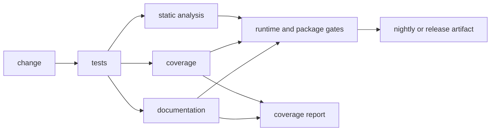
```mermaid
flowchart LR
  Change["change"] --> Tests["tests"]
  Tests --> Static["static analysis"]
  Tests --> Coverage["coverage"]
  Tests --> Docs["documentation"]
  Static --> Runtime["runtime and package gates"]
  Coverage --> Runtime
  Docs --> Runtime
  Runtime --> Artifact["nightly or release artifact"]
  Coverage --> Pages["coverage report"]
  Docs --> Pages
```

Concrete workflow jobs, presets and release mechanics are deployment concerns
and are documented in Chapter 8.

### 7.3 Traceability

Observable behavior should have coverage at the architectural boundary that owns
it. Matrix rows in the appendix describe the expected behavior, test family and
implementation location.

Machine-readable QA contracts live next to the scripts that enforce them.
Package layout is owned by `ci/package/package-layout-contract.json`, and UI
language plus OCR model coverage is owned by
`ci/localization/localization-contract.json`.

## 8. Deployment <a id="8-deployment"></a>

### 8.1 Delivery Model

FOSSredder is delivered as a Windows x64 desktop installer. The installed
runtime combines Qt/QML, SQLite, Poppler, OpenCV, Tesseract with bundled
[tessdata](#glossary-tessdata), and export support for CSV,
XLSX and ZIP. The repository does not currently publish a Docker image, NuGet
package or SDK artifact.

The main `Pipeline` workflow validates pushes and pull requests for `develop`
and `master`. A successful `develop` push can publish the mutable
`develop-nightly` pre-release. Stable releases are produced by the `Release`
workflow on `v*` tags and publish the installer together with SHA256 sums and a
release manifest.

### 8.2 Build And Packaging

`CMakePresets.json` is the canonical entry point for local development and CI.
The `app` preset builds the desktop application, `tests` enables the registered
test targets, `clang-tidy` and `coverage` configure quality runs, and
`release-installer` builds the CMake `package` target.

Installer packaging is owned by the CMake package target and the PowerShell
scripts under `ci/package`. The package step installs the application into a
staging directory, deploys Qt plugins, QML imports, translations, tessdata and
runtime DLLs, then creates the Inno Setup installer.

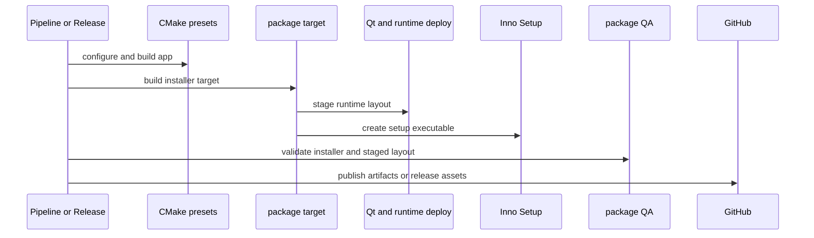
```mermaid
sequenceDiagram
    participant Workflow as Pipeline or Release
    participant CMake as CMake presets
    participant Package as package target
    participant Deploy as Qt and runtime deploy
    participant Inno as Inno Setup
    participant QA as package QA
    participant GH as GitHub

    Workflow->>CMake: configure and build app
    Workflow->>Package: build installer target
    Package->>Deploy: stage runtime layout
    Package->>Inno: create setup executable
    Workflow->>QA: validate installer and staged layout
    Workflow->>GH: publish artifacts or release assets
```

### 8.3 Runtime Layout

The [installer](#glossary-installer) stages a self-contained
[runtime layout](#glossary-runtime-layout) under the installation directory.

```text
<install-root>/
  bin/
    fossredder.exe
    qt.conf
    platforms/
      qwindows.dll
    qml/
      FossRedder/
      QtQuick/
      ...
    i18n/
      *.qm
    res/
      tessdata/
        deu.traineddata
        eng.traineddata
        fra.traineddata
        osd.traineddata
        *-fast.traineddata
        *-best.traineddata
```

`bin/qt.conf` pins Qt plugin and QML import lookup to the installed `bin`
directory. `bin/qml` contains Qt imports and the `FossRedder` QML module tree.
`bin/i18n` contains compiled Qt translation catalogs. `bin/res/tessdata`
contains required OCR language and orientation models.

`ci/package/package-layout-contract.json` verifies required runtime files, Qt
QML imports and FOSSredder QML modules. `ci/localization/localization-contract.json`
owns the expected UI languages and OCR models. Workspace files remain
user-managed `.fossredder` files and can be copied or backed up as regular
files.

### 8.4 Release Publishing

The installer artifact follows this filename format:

```text
FOSSredder-Setup-<version>-win-x64.exe
```

`develop-nightly` is a mutable pre-release for project validation before a
stable release. Stable releases are immutable GitHub Releases created from
version tags.

GitHub Pages is published by the main pipeline on `develop` and `master`.
It combines Doxygen HTML, coverage HTML and `ci/pages/index.html` into the
published site.

## 9. Security & Privacy <a id="9-security--privacy"></a>

### 9.1 Runtime Boundary

The installed application does not wire a telemetry client, crash-upload client
or cloud backend. Runtime dependencies are local application services, local
SQLite persistence and local infrastructure adapters. GitHub, Codecov and Pages
integrations exist in CI workflows, not in the desktop runtime.

If runtime network access is added later, it should be introduced through an
explicit core-owned [port](#glossary-port) and documented as
a new system boundary.

### 9.2 Local Data

Workspace state is stored in `workspace.fossredder` through the SQLite-backed
persistence layer. The latest-workspace registry is stored in `registry.db` and
contains the last opened workspace path, not the workspace catalog itself. UI
preferences are stored through Qt `QSettings` and can include user-selected
paths for imports, exports and processing tools.

Workspace files, registry data, preferences, exports and diagnostics are local
user data. The current implementation does not provide transparent workspace
encryption.

### 9.3 Diagnostics

Diagnostics are local filesystem outputs. The default error reporter writes via
`diagnostics::FileDiagnostics` and `diagnostics::SpdlogDiagnostics`, and import
processing wires `FileDiagnostics` for adapter-level debug output.

Import diagnostics can contain OCR text, parser output and image-derived
artifacts. New diagnostic artifacts should therefore stay local, avoid long-lived
raw document caches and have an explicit retention decision when they can contain
statement content.

### 9.4 Release Integrity

Stable releases are created from `v*` tags and include SHA256 checksums plus a
release manifest. `develop-nightly` is mutable and intended for validation before
a stable release.

The installer is not currently documented as
[code-signed](#glossary-code-signing), so Windows can show
an unknown-publisher warning. Repository secrets stay in GitHub Actions
configuration and are not stored in repository files.

## 10. Appendix <a id="10-appendix"></a>

### 10.1 Glossary

| Term | Meaning |
|---|---|
| <a id="glossary-adapter"></a>Adapter | Concrete implementation that translates between a port and an external library, service or UI workflow. |
| <a id="glossary-artifact"></a>Artifact | File or directory produced by CI or packaging, for example coverage HTML, Doxygen HTML, package logs or installer output. |
| <a id="glossary-catalog"></a>Catalog | Domain aggregate containing actors, properties, contracts, statements, transactions, analyses and annuals. |
| <a id="glossary-ci-pipeline"></a>CI pipeline | GitHub Actions workflow that validates build, tests, static analysis, coverage, documentation, Pages and develop-nightly packaging. |
| <a id="glossary-clean-architecture"></a>Clean Architecture | Dependency model where domain and application rules sit at the center, while UI, persistence, frameworks and external libraries stay outside and depend inward through ports. |
| <a id="glossary-cmake-preset"></a>CMake preset | Named CMake configure/build/test entry in `CMakePresets.json`. Presets are the supported way to describe repeatable local and CI builds. |
| <a id="glossary-cmake-target"></a>CMake target | Named build unit that owns sources, include paths, compile features and link dependencies. |
| <a id="glossary-code-signing"></a>Code signing | Cryptographic signing of installer or executable artifacts so Windows can identify the publisher. |
| <a id="glossary-composition-root"></a>Composition root | Startup boundary that is allowed to know concrete implementations and wire them together. In FOSSredder this is the `app` target. |
| <a id="glossary-coverage"></a>Coverage | Measurement of which code lines or regions are exercised by tests. FOSSredder generates LLVM/LCOV coverage and uploads Codecov input. |
| <a id="glossary-dto"></a>Data Transfer Object (DTO) | Plain request, result or snapshot structure used to cross architectural boundaries without exposing mutable domain objects. |
| <a id="glossary-develop-nightly"></a>Develop nightly | Mutable GitHub pre-release built from validated `develop` pipeline runs. |
| <a id="glossary-diagnostics"></a>Diagnostics | Local error reporting and debug artifact output routed through core-owned diagnostics ports. |
| <a id="glossary-domain-entity"></a>Domain entity | A domain object with identity and lifecycle, such as `Actor`, `Contract`, `Transaction` or `Annual`. |
| <a id="glossary-domain-language"></a>Domain language | The project vocabulary used by the product and the code, for example actor, property, contract, statement, transaction, analysis and annual. |
| <a id="glossary-doxygen"></a>Doxygen | Documentation generator used to produce HTML documentation from source comments and configured inputs. |
| <a id="glossary-draft"></a>Draft | Import-time statement or transaction state that can be reviewed before finalization. |
| <a id="glossary-export-log"></a>Export log | Persisted workflow record describing an export run, its status and produced output metadata. |
| <a id="glossary-pages"></a>GitHub Pages | Hosted GitHub site used here for generated documentation and coverage reports. |
| <a id="glossary-import-log"></a>Import log | Persisted workflow record describing an import run, its status and related draft/final statement. |
| <a id="glossary-infrastructure"></a>Infrastructure | Outer implementation code for concrete libraries and local I/O behind core-defined ports. |
| <a id="glossary-installer"></a>Installer | Windows setup executable produced by Inno Setup and attached to nightly or stable releases. |
| <a id="glossary-mvvm"></a>Model-View-ViewModel (MVVM) | UI architecture where QML views bind to `QObject` view models, while model data comes from core snapshots, commands and use-case ports. |
| <a id="glossary-persistence"></a>Persistence | SQLite-backed storage implementation for workspace state, repositories and the latest-workspace registry. |
| <a id="glossary-policy"></a>Policy | A named domain rule object for behavior that should not be hidden in UI, persistence or ad-hoc helpers. |
| <a id="glossary-port"></a>Port | Core-defined interface or DTO boundary consumed by UI, persistence or infrastructure. Ports keep dependency direction pointing inward. |
| <a id="glossary-qml-module"></a>QML module | Importable QML package described by `qmldir` files and loaded by the Qt QML engine. |
| <a id="glossary-quality-gate"></a>Quality gate | Required validation step that must pass before a branch, release or installer artifact is considered acceptable. |
| <a id="glossary-registry"></a>Registry | Small local `registry.db` used to remember the latest workspace path. |
| <a id="glossary-repository"></a>Repository | Persistence interface or implementation responsible for storing and loading one family of domain/application records. |
| <a id="glossary-runtime-layout"></a>Runtime layout | Installed file structure required for the application to start correctly, including executable, Qt plugins, QML modules, translations and tessdata. |
| <a id="glossary-snapshot"></a>Snapshot | Read model projected from workspace state for UI or use-case consumption. |
| <a id="glossary-stable-release"></a>Stable release | GitHub Release built from an immutable `v*` tag. |
| <a id="glossary-static-analysis"></a>Static analysis | Source/build analysis that checks code without relying only on runtime behavior. The current configured tool is clang-tidy. |
| <a id="glossary-telemetry"></a>Telemetry | Automatic runtime collection or upload of usage, diagnostic or environment data. |
| <a id="glossary-tessdata"></a>Tessdata | Tesseract OCR language and orientation model files bundled with the application. |
| <a id="glossary-test-matrix"></a>Test matrix | Table that maps behavior families to expected tests and implementation locations. |
| <a id="glossary-use-case"></a>Use case | Application-level operation that coordinates domain objects and ports to perform user-visible work. |
| <a id="glossary-value-object"></a>Value object | Immutable or normalization-focused domain type identified by its value rather than an id, such as `EntityName`, `MoneyAmount` or `Year`. |
| <a id="glossary-vcpkg-manifest"></a>vcpkg manifest | `vcpkg.json` dependency declaration used by CMake/vcpkg manifest mode. |
| <a id="glossary-view-model"></a>View model | QML-facing `QObject` that owns presentation state for one feature area. |
| <a id="glossary-workflow"></a>Workflow | Coordinator for multi-step or asynchronous behavior, for example import, analysis, annual or export execution. |
| <a id="glossary-workspace"></a>Workspace | User-managed `.fossredder` SQLite file containing catalog entities, workflow state and logs. |
| <a id="glossary-session-state"></a>Workspace session state | In-memory application state for the active workspace, including catalog data and workflow records. |

### 10.2 Test Matrices

Row-level QA traceability lives in
[docs/appendix/test-matrices.md](appendix/test-matrices.md).
