# Design — FOSSredder

Author: Wilhelm Altemeier

## Table of Contents
1. [Executive Summary](#1-executive-summary)
2. [System Context](#2-system-context)
3. [Architecture Design](#3-architecture-design)
4. [Core Domain & Application Model](#4-core-domain--application-model)
5. [Infrastructure Layer](#5-infrastructure-layer)
6. [UI Layer & Presentation](#6-ui-layer--presentation)
7. [Quality Assurance & Testing](#7-quality-assurance--testing)
8. [Deployment & Environment](#8-deployment--environment)
9. [Security & Privacy](#9-security--privacy)
10. [Reference Appendices](#reference-appendices)

---

## 1. Executive Summary <a id="1-executive-summary"></a>

FOSSredder is a local-first system for extracting, managing, and analyzing financial data from bank statements in PDF or image formats. The system transforms raw documents into a structured SQLite database to facilitate long-term financial reporting and annual accounting without cloud-based processing. The implementation covers the entire lifecycle from document rendering and computer vision-based table detection to the generation of persistent analysis snapshots and annual reports.

The technical architecture consists of a modular C++ engine that separates domain logic from the graphical user interface and third-party libraries. The ingestion pipeline follows a fixed sequence using Poppler for document rendering, OpenCV for table structure detection, and Tesseract OCR for text recovery. This process combines spatial coordinates with extracted text to identify transaction rows and columns. After parsing the metadata into domain objects, a matching layer uses scored alias and token matching to link transactions to actors, properties, and contracts for automated cost allocation.

Beyond data ingestion, the system provides a framework for creating immutable analysis objects and annual reports. These objects capture snapshots of financial data to ensure consistency, even if underlying records are modified. Users can extend these snapshots with additional data, such as tax-related vectors, and export the consolidated results into XLSX or CSV formats. The design ensures that the entire process from initial PDF rendering to final report generation is testable, private, and capable of producing results that can be verified against manual accounting records.

## 2. System Context <a id="2-system-context"></a>
### 2.1 Runtime Environment

FOSSredder is a local-first Windows desktop application. The runtime is built as
a Qt 6 / QML application with a C++20 backend, packaged for Windows x64, and
designed to operate without a server-side component.

The default workspace is created under Qt's application data location as
`workspace.fossredder`; the recent-workspace registry is stored separately as
`registry.db`. Both files are local SQLite databases. The registry is a
convenience index only, while the workspace file is the canonical application
state.

High-cost import work is executed asynchronously through the core job and import
services so the UI can remain responsive while PDFs are rendered, page images are
processed, OCR is executed, and draft transactions are created.

### 2.2 External Actors And Data Boundaries

The system has one human actor: the desktop user. The user provides input
documents, reviews detected statement data, maintains catalog data, and exports
validated results.

Inbound data:

- PDF bank statements and image files selected by the user.
- Workspace files opened from local storage.
- Optional user-provided export locations.

Outbound data:

- Saved workspace state in the local `workspace.fossredder` file.
- Generated exports such as XLSX, CSV, and ZIP-packaged export bundles.
- Local diagnostic artifacts created by import and packaging flows.

The application does not require telemetry, cloud synchronization, or remote API
calls for its core workflows. Any future feature that introduces network access
must be treated as a new system boundary, documented explicitly, and wired behind
a port so the local-first default remains testable.

### 2.3 Technical Constraints

Development stack:

- **Language:** C++20
- **Build system:** CMake presets
- **Dependency management:** vcpkg manifest mode
- **UI framework:** Qt 6, QML, Qt Quick
- **Packaging:** Inno Setup through the CMake `package` target

Runtime and processing stack:

- **PDF rendering:** Poppler infrastructure adapter
- **Image processing:** OpenCV infrastructure adapter
- **OCR:** Tesseract infrastructure adapter with bundled `tessdata`
- **Persistence:** SQLite-backed workspace and registry storage
- **Export:** CSV, XLSX, and archive adapters
- **Localization:** Qt Linguist catalogs plus bundled OCR language models

The repository is organized around CMake targets rather than one monolithic
binary. `app` owns startup and composition, `ui` owns presentation and
QML-facing state, `core` owns domain/application logic and ports, `persistence`
owns SQLite implementations, and `infra/*` owns concrete adapters for external
libraries.

### 2.4 Extension Rules

New code should preserve the system boundary described above:

- Add business rules, use-case orchestration, request DTOs, and ports in `core`.
- Add Qt/QML presentation state, view models, workflows, and UI adapters in
  `ui`.
- Add SQLite implementations in `persistence` only when the feature needs
  durable storage.
- Add concrete integrations with Poppler, OpenCV, Tesseract, xlnt, libzip, or
  similar external libraries under `infra/*`.
- Wire concrete implementations in `app`; do not let `core` depend on Qt UI,
  SQLite, or third-party infrastructure libraries directly.
- Keep long-running work cancellable, observable, and routed through existing
  job/import/export workflow patterns instead of blocking the UI thread.
- Update the relevant CMake target and test target when adding a new source
  file, port, adapter, or workflow.

### 2.5 Context Diagram

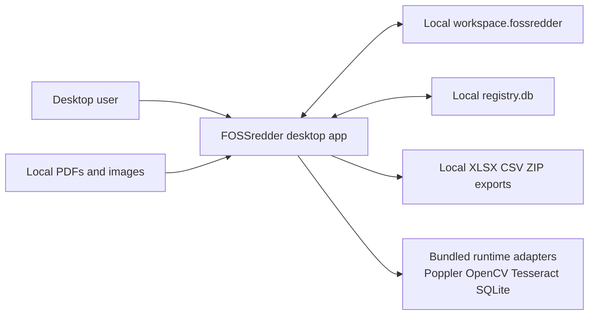
```mermaid
flowchart LR
  User["Desktop user"]
  Docs["Local PDFs and images"]
  Workspace["Local workspace.fossredder"]
  Registry["Local registry.db"]
  Exports["Local XLSX CSV ZIP exports"]
  App["FOSSredder desktop app"]
  Runtime["Bundled runtime adapters<br/>Poppler OpenCV Tesseract SQLite"]

  User --> App
  Docs --> App
  App <--> Workspace
  App <--> Registry
  App --> Exports
  App --> Runtime
```

## 3. Architecture Design <a id="3-architecture-design"></a>
### 3.1 Target-Level Architecture

FOSSredder is structured around CMake targets with explicit dependency
direction to meet [Clean Architecture](appendix/reference.md#glossary-clean-architecture) criteria:

- `app` builds the `fossredder` executable and acts as the [composition root](appendix/reference.md#glossary-composition-root).
- `ui` owns QML modules, view models, workflows, UI adapters, and shell wiring.
- `core` owns domain types, use-case services, workspace/session orchestration,
  jobs, policies, DTOs, and all public ports.
- `persistence` implements SQLite-backed storage, repository, registry, and
  workspace state persistence.
- `infra/*` implements external-library adapters for rendering, image
  processing, OCR, export, archive, and analysis-image rendering.
- `diagnostics` implements diagnostic sinks and the default error reporter.

`core/include/core/ports` is the architectural boundary for infrastructure and
use-case contracts. There is no separate `api` target; ports live with the
domain/application core so use cases can be tested without linking concrete
adapters.

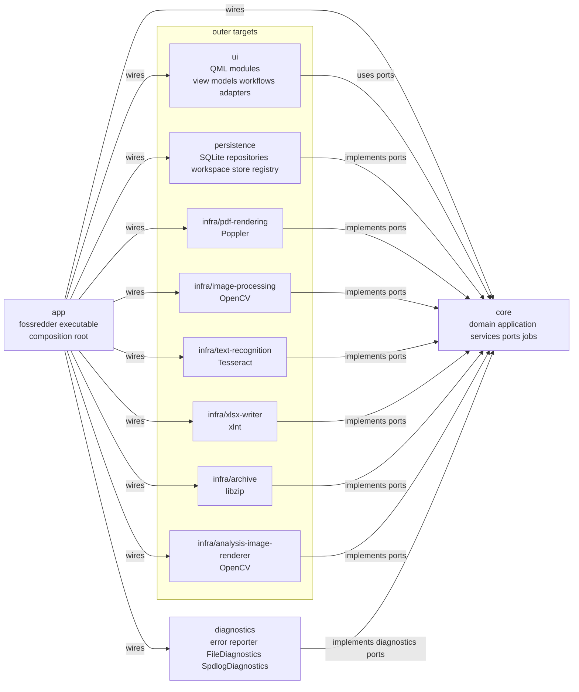
```mermaid
flowchart LR
  App["app<br/>fossredder executable<br/>composition root"]

  subgraph OuterTargets["outer targets"]
    direction TB
    UI["ui<br/>QML modules<br/>view models workflows adapters"]
    Persistence["persistence<br/>SQLite repositories workspace store registry"]
    InfraPdf["infra/pdf-rendering<br/>Poppler"]
    InfraImage["infra/image-processing<br/>OpenCV"]
    InfraText["infra/text-recognition<br/>Tesseract"]
    InfraXlsx["infra/xlsx-writer<br/>xlnt"]
    InfraArchive["infra/archive<br/>libzip"]
    InfraAnalysis["infra/analysis-image-renderer<br/>OpenCV"]
  end

  Core["core<br/>domain application services ports jobs"]
  Diagnostics["diagnostics<br/>error reporter FileDiagnostics SpdlogDiagnostics"]

  App -->|wires| UI
  App -->|wires| Persistence
  App -->|wires| InfraPdf
  App -->|wires| InfraImage
  App -->|wires| InfraText
  App -->|wires| InfraXlsx
  App -->|wires| InfraArchive
  App -->|wires| InfraAnalysis
  App -->|wires| Core
  App -->|wires| Diagnostics

  UI -->|uses ports| Core
  Persistence -->|implements ports| Core
  InfraPdf -->|implements ports| Core
  InfraImage -->|implements ports| Core
  InfraText -->|implements ports| Core
  InfraXlsx -->|implements ports| Core
  InfraArchive -->|implements ports| Core
  InfraAnalysis -->|implements ports| Core

  Diagnostics -->|implements diagnostics ports| Core
```

Read the diagram from left to right: `app` composes concrete targets, outer
targets depend inward on `core` ports, and `diagnostics` is just another outer
implementation target. `IErrorReporter` and `IDiagnostics` live in
`core/ports/diagnostics`; concrete file and spdlog sinks live outside the core.
Error reporting is passed explicitly through those ports; the core has no
process-wide error-reporter registry.

### 3.2 Dependency Direction

The dependency rule is intentionally simple: `core` defines contracts, outer
targets implement or consume them, and `app` wires concrete implementations
together at startup.

- `core` must not depend on Qt UI, SQLite, Poppler, OpenCV, Tesseract, xlnt, or
  libzip.
- `ui` may depend on `core` ports and snapshots, but it should call use cases
  through UI workflows/adapters instead of reaching into persistence or
  infrastructure targets.
- `persistence` may depend on `core` repository and storage ports, but storage
  decisions must stay behind workspace/session abstractions.
- `infra/*` may depend on `core` infra ports and the external library it wraps.
  It should not own domain policy.
- `diagnostics` implements core diagnostics ports. It can be wired where local
  diagnostics are needed, but business logic belongs in `core`.
- `app` is allowed to know all targets because it is the executable composition
  root.

### 3.3 Runtime Composition

Startup wiring happens in `app/src/main.cpp` and `app/src/main_qml.cpp`.
`app` constructs concrete adapters, creates the workspace facade, registers the
SQLite load/save functions, creates use-case runners, and then exposes the
workspace reader/writer ports to the UI shell.

At runtime, the dependency flow is:

1. QML sends user intent into `ui` view models and workflows.
2. UI workflows translate UI state into `core` requests or workspace commands.
3. `core` services execute domain rules against workspace snapshots and ports.
4. Concrete `persistence` and `infra/*` adapters perform local I/O or
   third-party-library work.
5. Results flow back as DTOs, snapshots, progress events, or diagnostics.

### 3.4 Design Principles

The architecture follows these mandates to keep the system maintainable:

- **Dependency inversion:** Use cases depend on interfaces and DTOs in
  `core/ports`. Concrete SQLite, OCR, rendering, export, and archive
  implementations are injected from outside the core.
- **Composition over global access:** Runtime wiring belongs in `app`. New
  features should not introduce global service locators or hidden singleton
  dependencies.
- **Snapshot-oriented UI boundary:** UI state is driven by workspace snapshots,
  command payloads, and explicit workflow state. QML should not mutate domain
  objects directly.
- **Decoupled execution:** Long-running import/export work must be cancellable,
  observable, and routed through job/workflow abstractions instead of blocking
  the Qt event loop.
- **Adapter isolation:** Third-party libraries are wrapped by focused adapters
  under `infra/*` or `persistence`, keeping library-specific error handling and
  data conversion out of domain code.
- **Testable seams:** Ports, DTOs, and workspace snapshots must remain small
  enough to fake in unit and interaction tests.

### 3.5 Adding Architectural Code

When adding a feature, choose the target based on responsibility:

- Add new domain rules, request/response DTOs, use-case services, and ports to
  `core`.
- Add UI-facing orchestration to `ui/src/workflows`, mapping logic to
  `ui/src/adapters`, and QML-facing state to `ui/src/viewmodels` or
  `ui/src/workspace`.
- Add concrete storage behavior to `persistence` and expose it through existing
  workspace/storage ports.
- Add external tool integrations as new or existing `infra/*` adapters.
- Add startup composition and dependency wiring in `app`, not in `core`.
- Add target wiring in the closest `CMakeLists.txt` and cover the seam with the
  nearest test family.

### 3.6 Layer Ownership And Refactor Rules

Layer ownership is intentionally narrow:

| Layer | Owns | Must not own |
|---|---|---|
| `core/domain` | Entities, value objects, invariants and reusable policies. | UI state, persistence details or workflow DTO storage. |
| `core/application` | Use-case orchestration, workspace services, imports, exports, analysis and annual workflows. | Qt/QML bindings or concrete third-party libraries. |
| `core/ports` | Public contracts for use cases, workspace access, persistence and infrastructure capabilities. | Concrete implementations. |
| `persistence` | SQLite schema, repositories, registry and workspace state storage. | Domain rules or UI projections. |
| `infra/*` | Concrete adapters for PDF rendering, image processing, OCR, archive and XLSX output. | Product workflows or UI decisions. |
| `ui/src` and `ui/include/ui` | QML-facing state, view models, workflows, adapters, selectors and payload mapping. | Domain invariants, persistence decisions or duplicated business rules. |
| `ui/qml` | Declarative composition, binding, layout, controls and user intent. | Core logic, workflow decisions or data transformation. |

Refactors should preserve behavior unless the issue explicitly changes it, stay
inside the owning layer, and remove dead wrappers or stale compatibility paths
instead of moving them. Search C++, QML and tests before renaming public API.
Create shared helpers only when they represent a stable project concept, not
just a few repeated lines.

## 4. Core Domain & Application Model <a id="4-core-domain--application-model"></a>
### 4.1 Domain-Driven Design Orientation

The `core` target is the inner boundary of FOSSredder. It follows a
[Domain-Driven Design (DDD)](appendix/reference.md#glossary-domain-driven-design) orientation: core
owns the domain language, application use cases and
[ports](appendix/reference.md#glossary-port) that connect the desktop UI, persistence and
[infrastructure adapters](appendix/reference.md#glossary-adapter) without making the core depend on
Qt, SQLite, Poppler, OpenCV, Tesseract, xlnt or Inno Setup.

The core is intentionally split into three primary areas:

| Area | Path | Responsibility |
|---|---|---|
| Domain model | `core/include/core/domain`, `core/src/domain` | Entities, value objects, policies and the workspace catalog. This code represents business concepts and invariants. |
| Application layer | `core/include/core/application`, `core/src/application` | Use-case orchestration, workspace session state, import parsing, matching, analysis, annual reports, export and storage coordination. |
| Ports | `core/include/core/ports` | Stable contracts used by UI, persistence and infrastructure. Ports contain snapshots, commands, request/result [DTOs](appendix/reference.md#glossary-dto) and abstract service interfaces. |

Supporting packages such as `core/errors`, `core/jobs`, `core/constants` and
`core/utils` are allowed to support the domain and application layer, but they
should stay out of business workflow ownership.

New core code should follow these rules:

- Put business vocabulary and invariants into `domain`.
- Put cross-entity workflow orchestration into `application`.
- Put boundary contracts into `ports`.
- Keep infrastructure names and third-party APIs outside the domain model.
- Prefer behavior methods on entities and policies over direct public mutation.
- Use snapshots and commands at the UI boundary instead of exposing mutable domain objects.

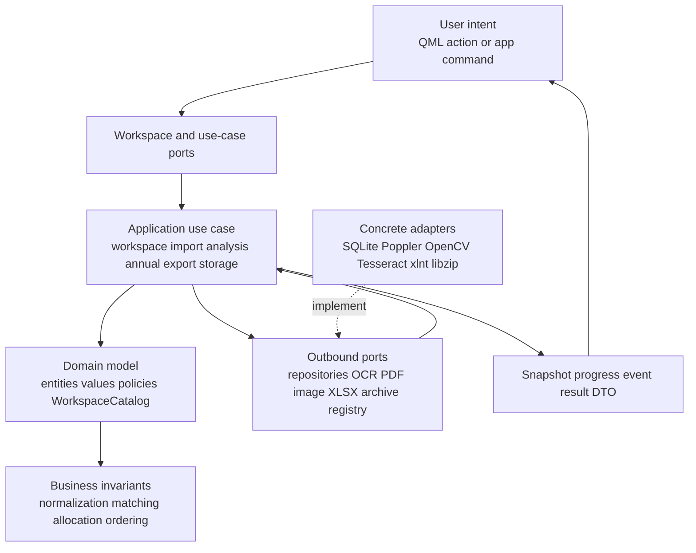
```mermaid
flowchart TB
  Intent["User intent<br/>QML action or app command"]
  UiBoundary["Workspace and use-case ports"]
  UseCase["Application use case<br/>workspace import analysis annual export storage"]
  Domain["Domain model<br/>entities values policies WorkspaceCatalog"]
  Invariants["Business invariants<br/>normalization matching allocation ordering"]
  OutboundPorts["Outbound ports<br/>repositories OCR PDF image XLSX archive registry"]
  Adapters["Concrete adapters<br/>SQLite Poppler OpenCV Tesseract xlnt libzip"]
  Result["Snapshot progress event result DTO"]

  Intent --> UiBoundary
  UiBoundary --> UseCase
  UseCase --> Domain
  Domain --> Invariants
  UseCase --> OutboundPorts
  Adapters -. implement .-> OutboundPorts
  OutboundPorts --> UseCase
  UseCase --> Result
  Result --> Intent
```

### 4.2 Domain Entities

Domain entities live under `core/include/core/domain/entities`. They are
identity-bearing objects and expose behavior-oriented methods such as `rename`,
`addAlias`, `setType`, `addTransaction`, `markVerified` or `apply`. Hydration
setters exist for persistence and snapshot reconstruction, but feature code
should prefer domain behavior and policies.

| Entity | Responsibility | Related values | Related policies and use cases |
|---|---|---|---|
| `Actor` | Represents a person, organization or counterparty that can be linked to contracts and transactions. Actors own aliases for import matching and contract relation ids for navigation. | `EntityName`, `Alias` | `AliasPolicy`, workspace commands, draft matching, transaction assignment. |
| `Property` | Represents an accounting object such as a property or cost center. Properties own aliases and contract relation ids. | `EntityName`, `Alias` | `AliasPolicy`, workspace commands, draft matching, transaction allocation. |
| `Contract` | Represents the allocation contract between actors and properties. Contracts group actor ids, property ids, aliases, type and allocatable mode. | `EntityName`, `ContractType`, `Alias` | `AliasPolicy`, draft matching, transaction assignment, export matrix generation. |
| `Statement` | Represents an imported statement and the ordered list of finalized transaction ids belonging to it. | `EntityName` | `StatementPolicy`, import finalization, workspace commands. |
| `Transaction` | Represents a finalized booking with booking date, valuta, amount, status, allocatable flag and optional links to statement, actor, contract and properties. | `BookingDate`, `MoneyAmount` | `TransactionPolicy`, draft finalization, analysis, annual reports, exports. |
| `Analysis` | Represents a persisted analysis definition and result state. It stores type, configuration, filters, export format, snapshot transactions and calculation adjustments. | `EntityName`, `AnalysisType`, `FilterSpec`, `ExportFormat` | `AnalysisPolicy`, `AnalysisService`, export use cases, annual reports. |
| `Annual` | Represents an annual aggregate for one year and an ordered set of linked analysis ids. | `EntityName`, `Year` | `AnnualPolicy`, `AnnualService`, export use cases. |
| `WorkspaceCatalog` | Aggregates the current domain entity collections for one workspace. It is the catalog state used by application services and matching logic. | Entity collections | Workspace session state, catalog projection, draft matching, analysis, annual and export services. |

The domain relationship model is:

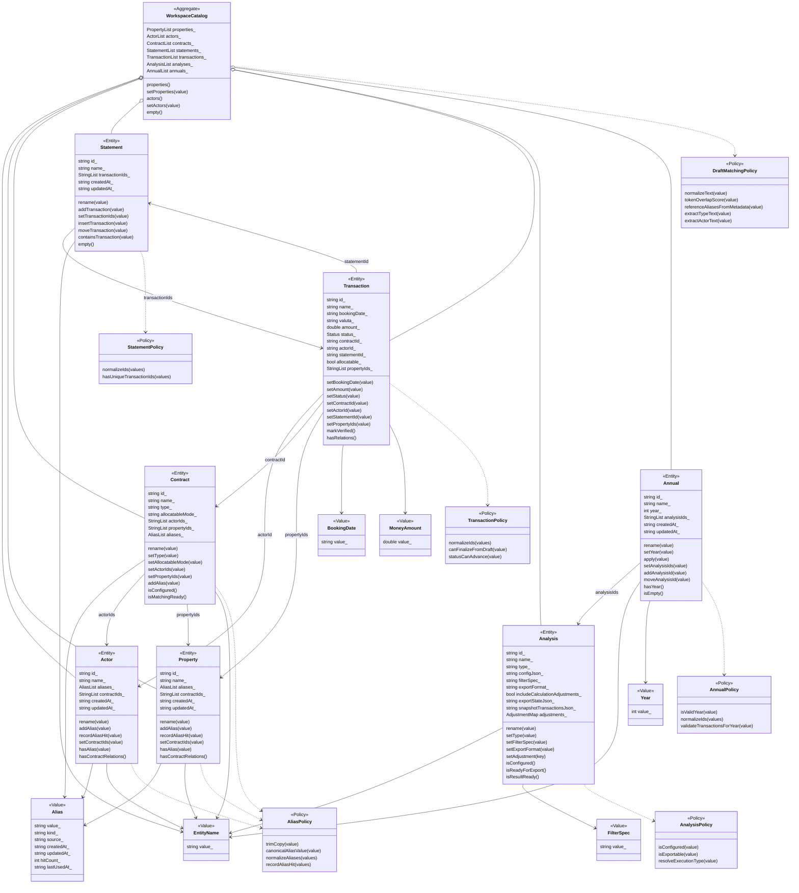
```mermaid
classDiagram
    direction TB

    class WorkspaceCatalog {
        <<Aggregate>>
        PropertyList properties_
        ActorList actors_
        ContractList contracts_
        StatementList statements_
        TransactionList transactions_
        AnalysisList analyses_
        AnnualList annuals_
        properties()
        setProperties(value)
        actors()
        setActors(value)
        empty()
    }

    class Actor {
        <<Entity>>
        string id_
        string name_
        AliasList aliases_
        StringList contractIds_
        string createdAt_
        string updatedAt_
        rename(value)
        addAlias(value)
        recordAliasHit(value)
        setContractIds(value)
        hasAlias(value)
        hasContractRelations()
    }

    class Property {
        <<Entity>>
        string id_
        string name_
        AliasList aliases_
        StringList contractIds_
        string createdAt_
        string updatedAt_
        rename(value)
        addAlias(value)
        recordAliasHit(value)
        setContractIds(value)
        hasAlias(value)
        hasContractRelations()
    }

    class Contract {
        <<Entity>>
        string id_
        string name_
        string type_
        string allocatableMode_
        StringList actorIds_
        StringList propertyIds_
        AliasList aliases_
        rename(value)
        setType(value)
        setAllocatableMode(value)
        setActorIds(value)
        setPropertyIds(value)
        addAlias(value)
        isConfigured()
        isMatchingReady()
    }

    class Statement {
        <<Entity>>
        string id_
        string name_
        StringList transactionIds_
        string createdAt_
        string updatedAt_
        rename(value)
        addTransaction(value)
        setTransactionIds(value)
        insertTransaction(value)
        moveTransaction(value)
        containsTransaction(value)
        empty()
    }

    class Transaction {
        <<Entity>>
        string id_
        string name_
        string bookingDate_
        string valuta_
        double amount_
        Status status_
        string contractId_
        string actorId_
        string statementId_
        bool allocatable_
        StringList propertyIds_
        setBookingDate(value)
        setAmount(value)
        setStatus(value)
        setContractId(value)
        setActorId(value)
        setStatementId(value)
        setPropertyIds(value)
        markVerified()
        hasRelations()
    }

    class Analysis {
        <<Entity>>
        string id_
        string name_
        string type_
        string configJson_
        string filterSpec_
        string exportFormat_
        bool includeCalculationAdjustments_
        string exportStateJson_
        string snapshotTransactionsJson_
        AdjustmentMap adjustments_
        rename(value)
        setType(value)
        setFilterSpec(value)
        setExportFormat(value)
        setAdjustment(key)
        isConfigured()
        isReadyForExport()
        isResultReady()
    }

    class Annual {
        <<Entity>>
        string id_
        string name_
        int year_
        StringList analysisIds_
        string createdAt_
        string updatedAt_
        rename(value)
        setYear(value)
        apply(value)
        setAnalysisIds(value)
        addAnalysisId(value)
        moveAnalysisId(value)
        hasYear()
        isEmpty()
    }

    class Alias {
        <<Value>>
        string value_
        string kind_
        string source_
        string createdAt_
        string updatedAt_
        int hitCount_
        string lastUsedAt_
    }

    class EntityName {
        <<Value>>
        string value_
    }

    class BookingDate {
        <<Value>>
        string value_
    }

    class MoneyAmount {
        <<Value>>
        double value_
    }

    class FilterSpec {
        <<Value>>
        string value_
    }

    class Year {
        <<Value>>
        int value_
    }

    class AliasPolicy {
        <<Policy>>
        trimCopy(value)
        canonicalAliasValue(value)
        normalizeAliases(values)
        recordAliasHit(values)
    }

    class TransactionPolicy {
        <<Policy>>
        normalizeIds(values)
        canFinalizeFromDraft(value)
        statusCanAdvance(value)
    }

    class StatementPolicy {
        <<Policy>>
        normalizeIds(values)
        hasUniqueTransactionIds(values)
    }

    class AnalysisPolicy {
        <<Policy>>
        isConfigured(value)
        isExportable(value)
        resolveExecutionType(value)
    }

    class AnnualPolicy {
        <<Policy>>
        isValidYear(value)
        normalizeIds(values)
        validateTransactionsForYear(value)
    }

    class DraftMatchingPolicy {
        <<Policy>>
        normalizeText(value)
        tokenOverlapScore(value)
        referenceAliasesFromMetadata(value)
        extractTypeText(value)
        extractActorText(value)
    }

    WorkspaceCatalog o-- Actor
    WorkspaceCatalog o-- Property
    WorkspaceCatalog o-- Contract
    WorkspaceCatalog o-- Statement
    WorkspaceCatalog o-- Transaction
    WorkspaceCatalog o-- Analysis
    WorkspaceCatalog o-- Annual

    Actor --> Alias
    Property --> Alias
    Contract --> Alias

    Contract --> Actor : actorIds
    Contract --> Property : propertyIds
    Statement --> Transaction : transactionIds
    Transaction --> Statement : statementId
    Transaction --> Actor : actorId
    Transaction --> Contract : contractId
    Transaction --> Property : propertyIds
    Annual --> Analysis : analysisIds

    Actor --> EntityName
    Property --> EntityName
    Contract --> EntityName
    Statement --> EntityName
    Analysis --> EntityName
    Annual --> EntityName
    Transaction --> BookingDate
    Transaction --> MoneyAmount
    Analysis --> FilterSpec
    Annual --> Year

    Actor ..> AliasPolicy
    Property ..> AliasPolicy
    Contract ..> AliasPolicy
    Statement ..> StatementPolicy
    Transaction ..> TransactionPolicy
    Analysis ..> AnalysisPolicy
    Annual ..> AnnualPolicy
    WorkspaceCatalog ..> DraftMatchingPolicy
```

### 4.3 Value Objects

Value objects are small normalized wrappers or semantic primitives used by
entities and policies. They keep low-level validation close to the domain
language and avoid spreading string normalization rules across application code.

| Value object | Used by | Purpose |
|---|---|---|
| `Alias` | `Actor`, `Property`, `Contract` | Stores a normalized matching token with kind, source and usage metadata such as hit count and last-used timestamp. |
| `EntityName` | `Actor`, `Property`, `Contract`, `Statement`, `Analysis`, `Annual` | Normalizes display names and rejects empty or overlong names. |
| `ContractType` | `Contract` | Normalizes contract type labels used for allocation and import matching. |
| `BookingDate` | `Transaction` | Normalizes booking date text and validates that it is non-empty and bounded. |
| `MoneyAmount` | `Transaction` | Validates numeric transaction amounts. |
| `AnalysisType` | `Analysis` | Normalizes the analysis execution type. |
| `ExportFormat` | `Analysis`, export use cases | Normalizes export format keys. |
| `FilterSpec` | `Analysis`, analysis filtering | Normalizes persisted filter specifications. |
| `Year` | `Annual` | Validates and normalizes supported annual report years. |

### 4.4 Domain Policies

Policies hold rules that do not belong to a single field setter or that must be
shared between entities and application services.

| Policy | Applies to | Responsibility |
|---|---|---|
| `AliasPolicy` | `Actor`, `Property`, `Contract`, draft matching | Trims, canonicalizes, deduplicates and records alias hits. This is the shared rule set for matching imported text to existing catalog entities. |
| `TransactionPolicy` | `Transaction`, `TransactionDraft`, draft finalization | Normalizes relation ids, validates booking date and amount, guards non-regressive status transitions and checks whether drafts can become finalized transactions. |
| `StatementPolicy` | `Statement`, import finalization | Normalizes transaction id lists and preserves unique ordered transaction references. |
| `AnalysisPolicy` | `Analysis`, `AnalysisService`, export | Validates analysis type, chart/table behavior, exportability, filter keys and whether an analysis is configured enough to run. |
| `AnnualPolicy` | `Annual`, `AnnualService` | Validates years, normalizes linked analysis ids and validates that transaction booking years match an annual year when required. |
| `DraftMatchingPolicy` | Import drafts, `WorkspaceCatalog` | Normalizes imported text, filters noisy tokens, extracts reference-like aliases and derives suggestions for actor, contract type and catalog selection. |

Policy placement rule: if a rule decides whether domain state is valid or how
domain text is normalized, it belongs in `domain/policies`. If a rule decides
which workflow step to run next, it belongs in `application`.

### 4.5 Application Use Cases

Application services orchestrate domain objects and ports. They can coordinate
multiple entities, call infrastructure ports and return DTOs, but they should
not leak infrastructure implementation types into the domain.

| Use case area | Main classes | Responsibility |
|---|---|---|
| Workspace | `WorkspaceFacade`, `WorkspaceSession`, `WorkspaceCommandService`, `WorkspaceQueryService`, `WorkspaceWorkflowService`, `WorkspaceStateManager`, `WorkspaceSnapshotProjector` | Owns the mutable `WorkspaceSessionState`, exposes reader/writer ports, validates commands, commits changes, projects snapshots and coordinates load/save behavior. |
| Import | `StatementImportRunner`, `IImportStatement`, `DefaultImportStatementStrategy`, `DefaultStatementParser`, `DefaultTransactionParser`, `DraftMatcher`, `DraftFinalizer` | Renders/extracts input documents through ports, parses statement pages into drafts, derives suggestions, supports pause/cancel/resume and finalizes drafts into domain statements and transactions. |
| Analysis | `AnalysisService`, `AnalysisWorkflowSupport`, `AnalysisFilter`, `TableAnalysis`, `PlotAnalysis`, `AdjustmentCalculation` | Runs configured analyses over workspace snapshots and produces tabular or chart-like results. |
| Annual | `AnnualService`, `AnnualWorkflowSupport` | Builds annual report results from a workspace snapshot, a target year and selected analyses. |
| Export | `ExportService`, `CsvExporter`, `XlsxExporter`, `ObjectExportExecutor`, `PropertyContractMatrix` | Exports analysis, annual and workspace data into CSV, XLSX or archive-oriented outputs through writer/archive ports. |
| Storage | `StorageManager`, `WorkspaceStateManager`, `RepositoryBundle`, `DeletionImpact` | Coordinates workspace file operations, atomic load/save callbacks and repository-backed state reconstruction. |

The internal workspace state is `WorkspaceSessionState`. It contains a
`WorkspaceCatalog` for durable domain entities and a `WorkspaceWorkflowState`
for workflow artifacts such as statement drafts, transaction drafts, import logs
and export logs. This split keeps transient import/export workflow records
separate from the core catalog while still saving them as part of a workspace
when required.

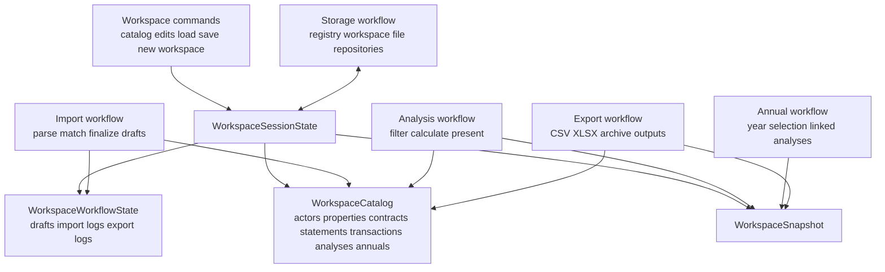
```mermaid
flowchart TB
  WorkspaceState["WorkspaceSessionState"]
  Catalog["WorkspaceCatalog<br/>actors properties contracts statements transactions analyses annuals"]
  WorkflowState["WorkspaceWorkflowState<br/>drafts import logs export logs"]
  Snapshot["WorkspaceSnapshot"]

  WorkspaceCommands["Workspace commands<br/>catalog edits load save new workspace"]
  ImportWorkflow["Import workflow<br/>parse match finalize drafts"]
  AnalysisWorkflow["Analysis workflow<br/>filter calculate present"]
  AnnualWorkflow["Annual workflow<br/>year selection linked analyses"]
  ExportWorkflow["Export workflow<br/>CSV XLSX archive outputs"]
  StorageWorkflow["Storage workflow<br/>registry workspace file repositories"]

  WorkspaceState --> Catalog
  WorkspaceState --> WorkflowState
  WorkspaceState --> Snapshot
  WorkspaceCommands --> WorkspaceState
  ImportWorkflow --> WorkflowState
  ImportWorkflow --> Catalog
  AnalysisWorkflow --> Snapshot
  AnalysisWorkflow --> Catalog
  AnnualWorkflow --> Snapshot
  ExportWorkflow --> Snapshot
  ExportWorkflow --> Catalog
  StorageWorkflow <--> WorkspaceState
```


### 4.6 Ports

Ports define the public contracts of the core. The dependency direction is
always inward: UI, persistence and infrastructure depend on core ports, while
the core only knows the port interfaces.

#### 4.6.1 Workspace Ports

Workspace ports are the main UI boundary.

| Port | Purpose |
|---|---|
| `IWorkspaceReader` | Read-only workspace access, current path, snapshots, draft lookup and identity helpers. |
| `IWorkspaceWriter` | Workspace mutation API for file operations, validation, catalog commands, draft finalization, logs, callbacks and error reporting. |
| `WorkspaceCommands` | Command DTOs used to mutate actors, properties, contracts, statements, transactions, analyses, annuals, drafts and logs. |
| `WorkspaceSnapshot` | Read DTOs used by UI and use cases. Snapshots mirror current state without exposing mutable domain objects. |

#### 4.6.2 Use-Case Ports

Use-case ports are implemented by application services and consumed by app/UI
composition.

| Port group | Interfaces and DTOs | Implemented by |
|---|---|---|
| Analysis | `IAnalysisRunner`, `AnalysisRequest`, `AnalysisResult` | `AnalysisService` |
| Annual | `IAnnualRunner`, `AnnualRequest`, `AnnualResult` | `AnnualService` |
| Export | `IExportRunner`, `ExportRequest`, `ExportResult` | `ExportService` |
| Import | `IImportRunner`, `ImportRequest`, `ImportResult` | `StatementImportRunner` |

#### 4.6.3 Infrastructure Ports

Infrastructure ports isolate third-party libraries and platform services.

| Port | Implementation area | Purpose |
|---|---|---|
| `IPdfRenderer` | `infra/pdf-rendering` | Render PDF pages and extract page text. |
| `IImageProcessor` | `infra/image-processing` | Mask, detect, crop and process images for import and analysis workflows. |
| `ITextRecognizer` | `infra/text-recognition` | Run OCR and return text-recognition results. |
| `IAnalysisImageRenderer` | `infra/analysis-image-renderer` | Render analysis visuals for export output. |
| `IArchive` | `infra/archive` | Create archive/package outputs for export. |
| `IXlsxWriter` | `infra/xlsx-writer` | Write XLSX tabular output. |
| `IStorageManager` | `core/application/storage`, `persistence` callbacks | Coordinate workspace file operations and atomic load/save. |
| `IRegistry` | `persistence` | Store and load application-level registry values such as the latest workspace path. |

#### 4.6.4 Repository Ports

Repository ports are still part of the persistence boundary and are used by
`WorkspaceStateManager` and persistence tests to reconstruct and store
workspace state through a `RepositoryBundle`.

| Repository port | Domain/application object |
|---|---|
| `IActorRepository` | `Actor` |
| `IPropertyRepository` | `Property` |
| `IContractRepository` | `Contract` |
| `IStatementRepository` | `Statement` |
| `ITransactionRepository` | `Transaction` |
| `IAnalysisRepository` | `Analysis` |
| `IAnnualRepository` | `Annual` |
| `IStatementDraftRepository` | `StatementDraft` |
| `ITransactionDraftRepository` | `TransactionDraft` |
| `IImportLogRepository` | `ImportLog` |
| `IExportLogRepository` | `ExportLog` |

New feature code should normally start from workspace or use-case ports. Add or
change repository ports only when persistence state shape changes or when the
repository-backed state manager needs a new storage operation.

### 4.7 Import Drafts, Logs And Finalization

Import drafts and logs are application workflow objects rather than domain
entities. They live under `core/application/import` and are persisted with the
workspace because the user can pause, review and finalize an import later.

| Workflow object | Responsibility |
|---|---|
| `StatementDraft` | Holds imported statement metadata and the ordered draft transaction ids/transactions before finalization. |
| `TransactionDraft` | Holds parsed transaction text, amount, booking date, candidate links, metadata, proof image information and manual override flags. |
| `ImportLog` | Records import events, status, source file information and draft/statement linkage. |
| `ExportLog` | Records export events, status and produced output metadata. |

The import flow is:

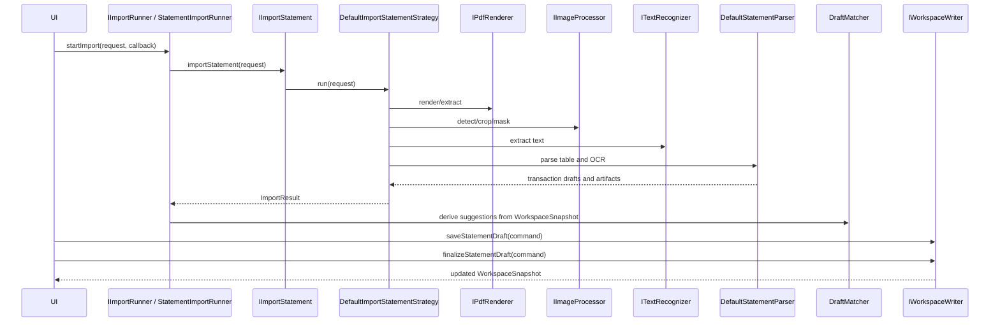
```mermaid
sequenceDiagram
    participant UI as UI
    participant Runner as IImportRunner / StatementImportRunner
    participant Importer as IImportStatement
    participant Strategy as DefaultImportStatementStrategy
    participant Pdf as IPdfRenderer
    participant Image as IImageProcessor
    participant Ocr as ITextRecognizer
    participant Parser as DefaultStatementParser
    participant Matcher as DraftMatcher
    participant Writer as IWorkspaceWriter

    UI->>Runner: startImport(request, callback)
    Runner->>Importer: importStatement(request)
    Importer->>Strategy: run(request)
    Strategy->>Pdf: render/extract
    Strategy->>Image: detect/crop/mask
    Strategy->>Ocr: extract text
    Strategy->>Parser: parse table and OCR
    Parser-->>Strategy: transaction drafts and artifacts
    Strategy-->>Runner: ImportResult
    Runner->>Matcher: derive suggestions from WorkspaceSnapshot
    UI->>Writer: saveStatementDraft(command)
    UI->>Writer: finalizeStatementDraft(command)
    Writer-->>UI: updated WorkspaceSnapshot
```

Finalization must be deterministic. A draft may become a finalized statement and
transactions only when required transaction data passes `TransactionPolicy`, the
statement relation can be established and the user-confirmed links can be mapped
back into the workspace catalog.

## 5. Infrastructure Layer <a id="5-infrastructure-layer"></a>
### 5.1 Scope And Dependency Rule

The infrastructure layer contains concrete implementations for ports defined by
`core`. It is allowed to depend on third-party libraries and operating-system
details. It must not introduce business rules or UI behavior.

Infrastructure code is split into two target families:

| Target family | Path | Responsibility |
|---|---|---|
| Persistence | `persistence` | SQLite database access, schema creation, migrations, repository implementations, workspace state load/save and latest-workspace registry. |
| External adapters | `infra/*` | Concrete adapters for Poppler, OpenCV, Tesseract, xlnt, ZIP/archive output and analysis image rendering. |

The application target is the composition root. `app/src/main.cpp` creates the
concrete persistence and infrastructure adapters, wires them to core ports, and
passes only port interfaces into application services.

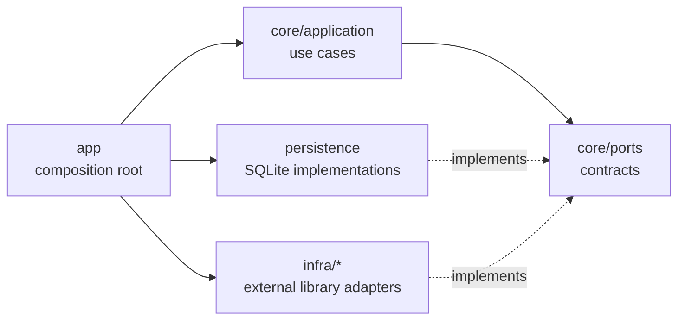
```mermaid
flowchart LR
    CorePorts["core/ports<br/>contracts"]
    App["app<br/>composition root"]
    Persistence["persistence<br/>SQLite implementations"]
    Infra["infra/*<br/>external library adapters"]
    CoreApp["core/application<br/>use cases"]

    CoreApp --> CorePorts
    Persistence -. implements .-> CorePorts
    Infra -. implements .-> CorePorts
    App --> Persistence
    App --> Infra
    App --> CoreApp
```

### 5.2 Persistence And Storage

FOSSredder uses local SQLite databases for both workspace state and the recent
workspace registry.

| File | Default location | Responsibility |
|---|---|---|
| `workspace.fossredder` | Qt application data location | Canonical workspace state. This file contains catalog entities, workflow drafts, import logs and export logs. |
| `registry.db` | Qt application data location | Convenience registry. It stores the latest opened workspace path and can be recreated without losing workspace data. |

The persistence boundary is intentionally atomic at the application level:

- `core::storage::StorageManager` owns file-path coordination and calls configured atomic load/save callbacks.
- `persistence::WorkspaceStateStore` loads and saves a complete `WorkspaceSessionState`.
- `persistence::SqliteDb` owns SQLite connection lifecycle.
- `persistence::SqliteSchema` is the authoritative schema and migration source.
- `persistence::SqliteTransaction` wraps transactional SQLite operations.
- `persistence::SqliteRegistry` implements `core::ports::storage::IRegistry`.
- Repository implementations under `persistence/include/persistence/repositories` and `persistence/src/repositories` implement repository ports used by state reconstruction, persistence tests and repository-level validation.

Runtime wiring in `app/src/main.cpp`:

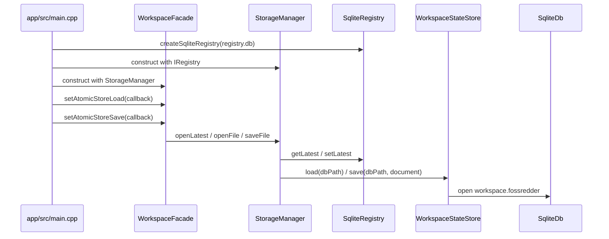
```mermaid
sequenceDiagram
    participant App as app/src/main.cpp
    participant Facade as WorkspaceFacade
    participant Storage as StorageManager
    participant Registry as SqliteRegistry
    participant Store as WorkspaceStateStore
    participant Db as SqliteDb

    App->>Registry: createSqliteRegistry(registry.db)
    App->>Storage: construct with IRegistry
    App->>Facade: construct with StorageManager
    App->>Facade: setAtomicStoreLoad(callback)
    App->>Facade: setAtomicStoreSave(callback)
    Facade->>Storage: openLatest / openFile / saveFile
    Storage->>Registry: getLatest / setLatest
    Storage->>Store: load(dbPath) / save(dbPath, document)
    Store->>Db: open workspace.fossredder
```

Persistence rules:

- Keep `SqliteSchema.cpp` as the source of truth for tables, indices, foreign keys and `PRAGMA user_version` migrations.
- Keep `WorkspaceStateStore` responsible for full-document load/save behavior.
- Keep registry persistence separate from workspace persistence.
- Preserve `PRAGMA foreign_keys = ON` behavior for all workspace databases.
- Add migrations for schema changes instead of relying on destructive recreation.
- Update repository tests and `WorkspaceStateStore` tests when changing persisted state.

### 5.3 Workspace Schema Overview

The current workspace schema stores the domain catalog and workflow state in one
SQLite database. The diagram mirrors the table and column shape created by
`persistence/src/SqliteSchema.cpp`.


```mermaid
erDiagram
    CONFIGS {
        TEXT name PK
        TEXT value
    }

    ACTORS {
        TEXT id PK
        TEXT name
        TEXT created_at
        TEXT updated_at
    }

    ACTOR_ALIASES {
        TEXT actor_id PK
        TEXT alias PK
        INTEGER hit_count
        TEXT created_at
        TEXT updated_at
        TEXT last_used_at
    }

    PROPERTIES {
        TEXT id PK
        TEXT name
        TEXT created_at
        TEXT updated_at
    }

    PROPERTY_ALIASES {
        TEXT property_id PK
        TEXT alias PK
        INTEGER hit_count
        TEXT created_at
        TEXT updated_at
        TEXT last_used_at
    }

    CONTRACTS {
        TEXT id PK
        TEXT name
        TEXT type
        TEXT allocatable_mode
        TEXT created_at
        TEXT updated_at
    }

    CONTRACT_ALIASES {
        TEXT contract_id PK
        TEXT alias PK
        INTEGER hit_count
        TEXT created_at
        TEXT updated_at
        TEXT last_used_at
    }

    CONTRACT_ACTORS {
        TEXT contract_id PK
        TEXT actor_id PK
    }

    CONTRACT_PROPERTIES {
        TEXT contract_id PK
        TEXT property_id PK
    }

    STATEMENTS {
        TEXT id PK
        TEXT name
        TEXT created_at
        TEXT updated_at
    }

    STATEMENT_TRANSACTIONS {
        TEXT statement_id PK
        TEXT transaction_id PK
        INTEGER position
    }

    STATEMENT_DRAFTS {
        TEXT id PK
        TEXT name
        TEXT created_at
        TEXT updated_at
    }

    STATEMENT_DRAFT_TRANSACTIONS {
        TEXT statement_draft_id PK
        TEXT transaction_draft_id PK
        INTEGER position
    }

    TRANSACTION_DRAFTS {
        TEXT id PK
        TEXT statement_draft_id FK
        INTEGER position
        TEXT name
        TEXT booking_date
        TEXT valuta
        REAL amount
        TEXT actor_text
        TEXT property_text
        TEXT actor_id
        INTEGER actor_selected
        TEXT contract_id
        INTEGER contract_selected
        TEXT metadata
        BLOB proof_image_data
        TEXT type
        INTEGER allocatable
        INTEGER allocatable_selected
        INTEGER status
        TEXT created_at
        TEXT updated_at
    }

    TRANSACTION_DRAFT_PROPERTIES {
        TEXT transaction_draft_id PK
        INTEGER property_position PK
        TEXT property_id
    }

    TRANSACTIONS {
        TEXT id PK
        TEXT name
        TEXT booking_date
        REAL amount
        TEXT statement_id FK
        INTEGER status
        TEXT actor_id FK
        TEXT contract_id FK
        TEXT valuta
        INTEGER allocatable
        TEXT created_at
        TEXT updated_at
    }

    TRANSACTION_PROPERTIES {
        TEXT transaction_id PK
        TEXT property_id PK
    }

    ANALYSES {
        TEXT id PK
        TEXT name
        TEXT type
        TEXT config_json
        TEXT filter_spec
        TEXT export_format
        INTEGER include_calc_adjustments
        TEXT export_state_json
        TEXT snapshot_transactions_json
        TEXT created_at
        TEXT updated_at
    }

    ANALYSIS_ADJUSTMENTS {
        TEXT analysis_id PK
        TEXT adjustment_key PK
        REAL adjustment_value
        INTEGER position
    }

    ANNUALS {
        TEXT id PK
        TEXT name
        INTEGER year
        TEXT created_at
        TEXT updated_at
    }

    ANNUAL_ANALYSES {
        TEXT annual_id PK
        TEXT analysis_id PK
        INTEGER position
    }

    IMPORT_LOGS {
        TEXT id PK
        TEXT time
        TEXT type
        TEXT file
        TEXT status
        TEXT message
        INTEGER draft_attached
        TEXT draft_id
        TEXT statement_id
    }

    IMPORT_LOG_STATEMENT_DRAFTS {
        TEXT import_log_id PK
        TEXT statement_draft_id PK
        INTEGER position
    }

    EXPORT_LOGS {
        TEXT id PK
        TEXT time
        TEXT target_path
        TEXT status
        TEXT message
        TEXT payload
    }

    EXPORT_LOG_ANNUALS {
        TEXT export_log_id PK
        TEXT annual_id PK
        INTEGER position
    }

    EXPORT_LOG_ANALYSES {
        TEXT export_log_id PK
        TEXT analysis_id PK
        INTEGER position
    }

    ACTORS ||--o{ ACTOR_ALIASES : aliases
    PROPERTIES ||--o{ PROPERTY_ALIASES : aliases
    CONTRACTS ||--o{ CONTRACT_ALIASES : aliases
    CONTRACTS ||--o{ CONTRACT_ACTORS : actor_links
    ACTORS ||--o{ CONTRACT_ACTORS : contracts
    CONTRACTS ||--o{ CONTRACT_PROPERTIES : property_links
    PROPERTIES ||--o{ CONTRACT_PROPERTIES : contracts
    STATEMENTS ||--o{ STATEMENT_TRANSACTIONS : ordering
    TRANSACTIONS ||--o{ STATEMENT_TRANSACTIONS : member
    STATEMENTS ||--o{ TRANSACTIONS : statement_id
    ACTORS ||--o{ TRANSACTIONS : actor_id
    CONTRACTS ||--o{ TRANSACTIONS : contract_id
    TRANSACTIONS ||--o{ TRANSACTION_PROPERTIES : property_links
    PROPERTIES ||--o{ TRANSACTION_PROPERTIES : transactions
    ANALYSES ||--o{ ANALYSIS_ADJUSTMENTS : adjustments
    ANNUALS ||--o{ ANNUAL_ANALYSES : analysis_order
    ANALYSES ||--o{ ANNUAL_ANALYSES : annuals
    STATEMENT_DRAFTS ||--o{ STATEMENT_DRAFT_TRANSACTIONS : ordering
    TRANSACTION_DRAFTS ||--o{ STATEMENT_DRAFT_TRANSACTIONS : member
    STATEMENT_DRAFTS ||--o{ TRANSACTION_DRAFTS : statement_draft_id
    TRANSACTION_DRAFTS ||--o{ TRANSACTION_DRAFT_PROPERTIES : property_links
    IMPORT_LOGS ||--o{ IMPORT_LOG_STATEMENT_DRAFTS : drafts
    STATEMENT_DRAFTS ||--o{ IMPORT_LOG_STATEMENT_DRAFTS : logs
    EXPORT_LOGS ||--o{ EXPORT_LOG_ANNUALS : annuals
    ANNUALS ||--o{ EXPORT_LOG_ANNUALS : export_logs
    EXPORT_LOGS ||--o{ EXPORT_LOG_ANALYSES : analyses
    ANALYSES ||--o{ EXPORT_LOG_ANALYSES : export_logs
```

### 5.4 External Library Adapters

External libraries are isolated behind infrastructure ports. The import,
analysis and export services only see core port types.

| Core port | Target | Main implementation | External dependencies |
|---|---|---|---|
| `IPdfRenderer` | `infra/pdf-rendering` | `PopplerPdfRendererAdapter`, `PopplerCore` | Poppler, OpenCV, nlohmann-json |
| `IImageProcessor` | `infra/image-processing` | `OpenCvImageProcessorAdapter`, `DenoiseAdapter`, `MaskAdapter`, `DetectAdapter`, `CropAdapter` | OpenCV |
| `ITextRecognizer` | `infra/text-recognition` | `TesseractTextRecognizerAdapter`, `TesseractCore` | Tesseract |
| `IAnalysisImageRenderer` | `infra/analysis-image-renderer` | `OpenCvAnalysisImageRendererAdapter` | OpenCV |
| `IXlsxWriter` | `infra/xlsx-writer` | `XlntTableWriterAdapter` | xlnt |
| `IArchive` | `infra/archive` | `ZipArchiveAdapter` | libzip |

Adapter rules:

- Translate between third-party types and `core::ports::*` DTOs at the adapter boundary.
- Keep third-party headers out of domain entities and application policies.
- Honor cancellation flags where request DTOs provide them.
- Prefer deterministic outputs and structured error reporting over exceptions that escape into UI code.
- Add unit tests under the corresponding `infra/*/tests` directory when adapter behavior changes.

### 5.5 Runtime Assets

Infrastructure assets must be installed with the application and must not depend
on source-tree paths at runtime.

| Asset group | Source | Installed/runtime location | Consumer |
|---|---|---|---|
| OCR models | `infra/text-recognition/res/tessdata/*.traineddata` | `bin/res/tessdata` | `TesseractTextRecognizerAdapter` / `TesseractCore` |
| QML modules | `ui/qml` | `bin/qml` | Qt runtime |
| Translation catalogs | `app/i18n` and generated `.qm` files | `bin/i18n` | Qt localization |
| Application assets | `app/assets` | `share/fossredder/assets` | application runtime and installer metadata |

The packaged OCR set currently includes German, English and French models in
standard, fast and best variants, plus `osd.traineddata`. Packaging validation
checks that every source `.traineddata` file is staged under `bin/res/tessdata`.

### 5.6 Concurrency And Cancellation Contract

The scheduler and job orchestration live in `core/jobs`, not in infrastructure.
Infrastructure adapters participate by honoring request-level cancellation and
by avoiding ownership of cross-use-case scheduling policy.

Import-related infrastructure work follows these constraints:

- PDF rendering, image processing and OCR requests may receive cancellation flags.
- OCR work is bounded by core import/job logic before calling `ITextRecognizer`.
- Adapters may use local helper objects, but long-running workflow state belongs in core application services.
- Diagnostic artifacts should be optional and should not be required for successful runtime behavior.

### 5.7 Diagnostics And Artifacts

Diagnostics are cross-cutting but must stay behind explicit sinks and result
objects.

| Source | Diagnostic output |
|---|---|
| Import pipeline | Parser logs, OCR TSV data, proof-image data and page artifacts are returned through import results or draft state. |
| Infrastructure adapters | Optional diagnostic files through `core::ports::diagnostics::IDiagnostics` / `diagnostics::FileDiagnostics`. |
| Persistence | Repository diagnostics helpers and explicit SQLite exceptions for schema, connection and transaction failures. |
| Application startup | Error reporter wiring in `app/src/main.cpp` translates Qt and runtime errors into structured reports. |

### 5.8 Adding Infrastructure Code

Use this workflow when adding or changing infrastructure:

1. Define or extend a core port first if the use case needs a new capability.
2. Implement the port in `infra/*` or `persistence`, not in `core`.
3. Wire the concrete implementation in `app/src/main.cpp` or a composition helper.
4. Add the source file to the owning CMake target.
5. Add install/package rules for runtime assets such as tessdata, QML imports or plugin files.
6. Add unit tests for adapter behavior and persistence tests for schema/repository changes.
7. Update `ci/package/test-package-layout.ps1` when a new runtime asset is required by the installed app.
8. Update this design document when the dependency boundary, schema shape or runtime asset contract changes.

## 6. UI Layer & Presentation <a id="6-ui-layer--presentation"></a>

The UI layer owns the desktop presentation model. It bridges Qt/QML with core
workspace and use-case ports, but it does not own domain rules, persistence
schema, OCR/PDF/image-processing integrations or export algorithms.

QML, C++ view models, UI workflows and shell wiring share one presentation
contract. This chapter is therefore structured by runtime role rather than by
file extension.

### 6.1 UI Architecture Scope

The UI target is organized into these areas:

| Area | Path | Responsibility |
|---|---|---|
| QML shell and views | `ui/qml/FossRedder` | Declarative layout, navigation routing, view composition, reusable controls and theme definitions. |
| Shell composition | `ui/include/ui/shell`, `ui/src/shell`, `ui/include/MainWindow.h` | Main window hosting, QML runtime setup, AppContext, navigation, status, settings, actions and object wiring. |
| Workspace roles | `ui/include/ui/workspace`, `ui/src/workspace` | UI-side snapshot store, command submission, read selectors and selected-entity state. |
| View models | `ui/include/ui/viewmodels`, `ui/src/viewmodels` | QML-facing state and operations for each feature area. |
| Workflows | `ui/include/ui/workflows`, `ui/src/workflows` | Longer UI flows such as import, analysis, annual and export execution. |
| Adapters | `ui/include/ui/adapters`, `ui/src/adapters` | Thin translation layer from UI workflows to core use-case runner ports. |
| Platform services | `ui/include/ui/platform`, `ui/src/platform` | Native file dialogs, filesystem browsing and runtime language switching. |
| Observability | `ui/include/ui/observability`, `ui/src/observability` | UI-specific trace origins and diagnostic helpers. |

The UI uses an [MVVM](appendix/reference.md#glossary-mvvm)-oriented structure:

- QML reads and invokes QML-facing `QObject` APIs.
- View models own presentation state and form behavior.
- Workspace roles project core snapshots into QML payloads and submit commands to core writer ports.
- Workflows coordinate multi-step or asynchronous UI behavior.
- Adapters invoke core use-case runners and translate between Qt-facing and core-facing types.

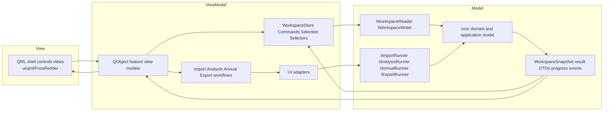
```mermaid
flowchart LR
  subgraph View["View"]
    QmlViews["QML shell controls views<br/>ui/qml/FossRedder"]
  end

  subgraph ViewModel["ViewModel"]
    FeatureVms["QObject feature view models"]
    WorkspaceRoles["WorkspaceStore Commands Selection Selectors"]
    UiWorkflows["Import Analysis Annual Export workflows"]
    UiAdapters["UI adapters"]
  end

  subgraph Model["Model"]
    WorkspacePorts["IWorkspaceReader IWorkspaceWriter"]
    UseCasePorts["IImportRunner IAnalysisRunner IAnnualRunner IExportRunner"]
    Snapshots["WorkspaceSnapshot result DTOs progress events"]
    CoreModel["core domain and application model"]
  end

  QmlViews --> FeatureVms
  FeatureVms --> WorkspaceRoles
  FeatureVms --> UiWorkflows
  WorkspaceRoles --> WorkspacePorts
  UiWorkflows --> UiAdapters
  UiAdapters --> UseCasePorts
  WorkspacePorts --> CoreModel
  UseCasePorts --> CoreModel
  CoreModel --> Snapshots
  Snapshots --> WorkspaceRoles
  Snapshots --> FeatureVms
  FeatureVms --> QmlViews
```

### 6.2 QML Runtime And Composition

QML startup is split between the app target and the UI target.

| Component | Responsibility |
|---|---|
| `app/src/main_qml.cpp` | Creates `MainWindow`, calls `ui::shell::createComposition`, wires workspace callbacks, registers QML warnings and starts the Qt event loop. |
| `MainWindow` | Hosts the `QQuickView`, owns shell objects, exposes workspace roles, loads QML and handles close/autosave/window events. |
| `ui::shell::createComposition` | Creates adapters, workflows, view models and platform services, then attaches them to `AppContext`. |
| `ui::bootstrap::registerTypes` | Registers C++ types and enum contracts for the `FossRedder 1.0` QML module. |
| `ui::bootstrap::configureRuntime` | Adds QML import paths and runtime plugin paths for installed and local runs. |

Runtime object graph:

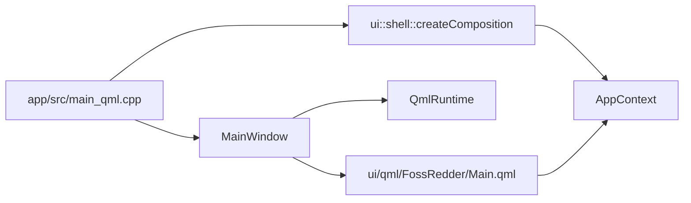
```mermaid
flowchart LR
    App["app/src/main_qml.cpp"]
    MainWindow["MainWindow"]
    Composition["ui::shell::createComposition"]
    AppContext["AppContext"]
    QmlRuntime["QmlRuntime"]
    QML["ui/qml/FossRedder/Main.qml"]

    App --> MainWindow
    App --> Composition
    Composition --> AppContext
    MainWindow --> QmlRuntime
    MainWindow --> QML
    QML --> AppContext
```

### 6.3 QML Module Structure

The QML module is `FossRedder 1.0`. `Main.qml` creates the root
`Components.Shell` and passes the provided `AppContext` and `Theme` singletons
into it.

| QML area | Responsibility |
|---|---|
| `Main.qml` | Root QML entry point loaded by `MainWindow`. |
| `Components` | Shell layout, app menu, toolbar, sidebar/content routers, status bar and reusable shell-level components. |
| `Controls` | Project-specific controls such as buttons, panels, dropdowns, scrollbars, fields and progress bars. |
| `Views/*` | Feature screens for actors, properties, contracts, booking, import/draft review, analysis, annual reports, export and settings. |
| `Theme` | Dark/light palettes and shared design tokens consumed by shell, controls and views. |
| `Assets` | SVG icons used by navigation and feature views. |

The installed package must contain the same QML module descriptors that are
listed in `ci/package/package-layout-contract.json`.

| QML module contract | Modules |
|---|---|
| Root | `FossRedder` |
| Shared modules | `FossRedder.Components`, `FossRedder.Controls`, `FossRedder.Views` |
| Feature view modules | `FossRedder.Views.Actor`, `FossRedder.Views.Analysis`, `FossRedder.Views.Annual`, `FossRedder.Views.Booking`, `FossRedder.Views.Contract`, `FossRedder.Views.Export`, `FossRedder.Views.Import`, `FossRedder.Views.Property`, `FossRedder.Views.Settings` |

The shell uses `ContentRouter.qml` and `SidebarRouter.qml` to select the active
feature view from `Navigation`. Feature views receive only the view model(s) and
theme data they need.

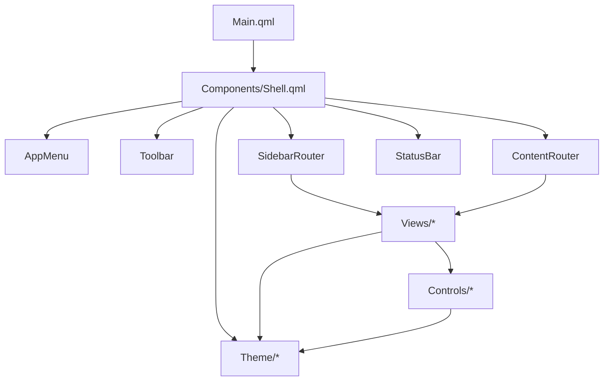
```mermaid
flowchart TB
    Main["Main.qml"]
    Shell["Components/Shell.qml"]
    AppMenu["AppMenu"]
    Toolbar["Toolbar"]
    SidebarRouter["SidebarRouter"]
    ContentRouter["ContentRouter"]
    StatusBar["StatusBar"]
    Views["Views/*"]
    Controls["Controls/*"]
    Theme["Theme/*"]

    Main --> Shell
    Shell --> AppMenu
    Shell --> Toolbar
    Shell --> SidebarRouter
    Shell --> ContentRouter
    Shell --> StatusBar
    SidebarRouter --> Views
    ContentRouter --> Views
    Views --> Controls
    Shell --> Theme
    Views --> Theme
    Controls --> Theme
```

### 6.4 AppContext And Shell State

`AppContext` is the QML-facing shell object. It is provided as the stable access
point for application-wide actions, navigation, status, platform services and
feature view models.

| AppContext member | Purpose |
|---|---|
| `Actions` | File/menu actions and browse/drop signals for import/export/workspace flows. |
| `Navigation` | Active top-level section and settings sub-section. |
| `Status` | User-visible shell status text. |
| `FileSystemBrowser` | QML-facing filesystem helper. |
| `LanguageService` | Available UI languages and runtime language switching. |
| Feature view models | QML APIs for actor, property, contract, booking, import, analysis, annual, export and settings screens. |
| `isDebugBuild` | Runtime flag exposed to QML for debug-only behavior. |

Shell-state rules:

- Add new global QML-facing services to `AppContext` only when they are needed by multiple feature areas.
- Keep feature-specific state inside the relevant view model or workflow.
- Keep navigation values stable through `QmlContracts` and `Navigation`.
- Prefer queued Qt signals for UI refreshes when updates can be coalesced.

### 6.5 Workspace UI Roles

The UI does not mutate domain objects directly. It consumes workspace snapshots
and submits typed commands through the core workspace ports.

| Role | Responsibility |
|---|---|
| `WorkspaceStore` | Holds the current `WorkspaceSnapshot`, current path and UI data revision. |
| `WorkspaceCommands` | Converts UI intent into core `IWorkspaceWriter` commands, validates commands and refreshes the store after successful mutations. |
| `WorkspaceSelectors` | Projects snapshot data into QML-friendly rows, dropdowns and lookup payloads. |
| `WorkspaceSelection` | Tracks currently selected actor, property, contract, statement, transaction, analysis and annual ids. |
| `WorkspacePayloads` / `PayloadMapper` | Convert between snapshot DTOs and QVariant/QML payloads. |

Workspace update flow:

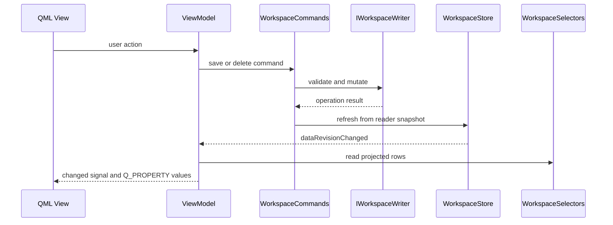
```mermaid
sequenceDiagram
    participant QML as QML View
    participant VM as ViewModel
    participant Commands as WorkspaceCommands
    participant Writer as IWorkspaceWriter
    participant Store as WorkspaceStore
    participant Selectors as WorkspaceSelectors

    QML->>VM: user action
    VM->>Commands: save or delete command
    Commands->>Writer: validate and mutate
    Writer-->>Commands: operation result
    Commands->>Store: refresh from reader snapshot
    Store-->>VM: dataRevisionChanged
    VM->>Selectors: read projected rows
    VM-->>QML: changed signal and Q_PROPERTY values
```

Deletion impact flow:

- Core workspace writer reports a deletion impact through the callback registered in `wireWorkspaceCallbacks`.
- `WorkspaceStore::applyDeletionImpact` removes stale references from the UI snapshot.
- `WorkspaceSelection` validates selections after the store changes.
- View models emit change signals so QML refreshes only through their public API.

### 6.6 View Models, Workflows And Adapters

View models are the public QML API for feature screens. Workflows own longer
operations, and adapters invoke core use-case ports.

| Feature | View model | Workflow | Adapter / core runner |
|---|---|---|---|
| Actors | `ActorViewModel` | workspace commands only | `IWorkspaceWriter` through `WorkspaceCommands` |
| Properties | `PropertyViewModel` | workspace commands only | `IWorkspaceWriter` through `WorkspaceCommands` |
| Contracts | `ContractViewModel` | workspace commands only | `IWorkspaceWriter` through `WorkspaceCommands` |
| Booking | `BookingViewModel` | workspace commands only | `IWorkspaceWriter` through `WorkspaceCommands` |
| Import | `ImportViewModel` | `ImportWorkflow` | `ImportAdapter` -> `IImportRunner` |
| Analysis | `AnalysisViewModel` | `AnalysisWorkflow` | `AnalysisAdapter` -> `IAnalysisRunner` |
| Annual | `AnnualViewModel` | `AnnualWorkflow` | `AnnualAdapter` -> `IAnnualRunner` |
| Export | `ExportViewModel` | `ExportWorkflow` | `ExportAdapter` -> `IExportRunner` |
| Settings | `SettingsViewModel` | settings and platform services | `Settings`, `LanguageService`, `Actions` |

Feature workflows follow the same MVVM path when they need asynchronous or
multi-step behavior. Simple catalog screens stop after `WorkspaceCommands`;
import, analysis, annual and export continue through workflow and adapter
objects before entering core use-case runners.

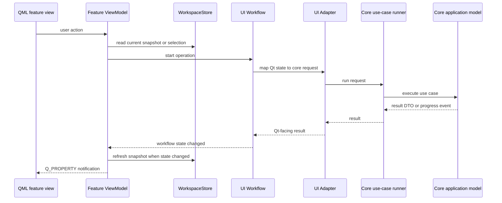
```mermaid
sequenceDiagram
    participant View as QML feature view
    participant VM as Feature ViewModel
    participant Store as WorkspaceStore
    participant Workflow as UI Workflow
    participant Adapter as UI Adapter
    participant Runner as Core use-case runner
    participant Core as Core application model

    View->>VM: user action
    VM->>Store: read current snapshot or selection
    VM->>Workflow: start operation
    Workflow->>Adapter: map Qt state to core request
    Adapter->>Runner: run request
    Runner->>Core: execute use case
    Core-->>Runner: result DTO or progress event
    Runner-->>Adapter: result
    Adapter-->>Workflow: Qt-facing result
    Workflow-->>VM: workflow state changed
    VM->>Store: refresh snapshot when state changed
    VM-->>View: Q_PROPERTY notification
```

Workflow rules:

- View models expose QML-friendly `Q_PROPERTY` values and invokable operations.
- Workflows may hold in-memory UI session state, such as active import drafts or running export state.
- Adapters must remain thin; they translate calls and should not duplicate core business rules.
- Long-running workflow results are reported back through Qt signals and view-model refresh methods.
- Before storage save, active import draft state is flushed through the callback installed by `createComposition`.

### 6.7 Platform Services And Observability

Platform services keep native Qt/desktop integration out of feature view models.

| Service | Responsibility |
|---|---|
| `FileDialogs` | Native dialogs for import files, export targets and workspace files. |
| `FileSystemBrowser` | QML-facing file/directory browsing helpers. |
| `LanguageService` | Translation discovery, QTranslator management, language persistence and QML retranslation. |
| `Settings` | Persistent UI preferences such as theme mode, autosave, import defaults, export defaults and toolbar visibility. |
| `QmlDiagnostics` | QML warning/error forwarding. |
| `Trace`, `Origins`, `ErrorCodes` | UI diagnostic metadata for structured error reporting. |

### 6.8 Adding UI Features

Use this workflow when adding a new UI feature or screen:

1. Add or extend the core workspace/use-case port first if new domain behavior is required.
2. Add UI projection helpers in `WorkspaceSelectors` or `WorkspacePayloads` when QML needs new snapshot data.
3. Add workspace mutations to `WorkspaceCommands` when the UI needs to submit new core commands.
4. Add a feature view model under `ui/viewmodels` for QML-facing state.
5. Add a workflow under `ui/workflows` only when the feature has multi-step or asynchronous behavior.
6. Add an adapter under `ui/adapters` only when the feature invokes a core use-case runner.
7. Register or attach the new object in `ui::shell::createComposition` and `AppContext`.
8. Add QML components under `ui/qml/FossRedder/Views/<Feature>` and route them through `ContentRouter` and `SidebarRouter` when the feature is top-level.
9. Add unit tests for view models/workflows/adapters and QML tests for reusable views or controls.

### 6.9 UI Source And QML Rules

View models are narrow QML API surfaces. Public `Q_PROPERTY` and `Q_INVOKABLE`
members should map to values QML binds or actions QML triggers. View models may
hold presentation state such as text fields, selected ids, dirty state,
expanded state and button enablement; they must not mutate domain objects,
parse business formats, calculate analysis output, finalize imports, export
files or inspect aggregates directly.

Catalog CRUD goes through `WorkspaceCommands`, workspace reads go through
`WorkspaceSelectors`, and cross-view selection goes through
`WorkspaceSelection`. Multi-step use cases go through feature workflows and
core use-case ports. UI adapters translate between Qt/QML-friendly types and
core ports; they should mostly map, delegate, bridge cancellation/progress and
convert payloads.

QML remains declarative: compose UI, bind state and emit user intent. Feature
screens live under `ui/qml/FossRedder/Views/<Feature>/`, new QML files are
registered in the owning `qmldir`, and shared `Controls`, `Components` and
theme values should be preferred over one-off colors, spacing, sizes or layout
hacks.

## 7. Quality Assurance & Testing <a id="7-quality-assurance--testing"></a>

Quality assurance is a design boundary, not only a CI activity. The test suite
mirrors the product architecture: domain rules stay in core tests, SQLite
behavior stays in persistence tests, external-library behavior stays in
infrastructure tests, and QML-facing behavior stays in UI/QML tests.

Chapter 7 covers the QA strategy, the test pyramid, quality gates, engineering
traceability rules and a compact matrix summary. Full row-level traceability
lives in [docs/appendix/test-matrices.md](appendix/test-matrices.md).
Machine-readable runtime and localization contracts remain next to the CI
scripts that enforce them.

### 7.1 QA Strategy And Test Pyramid

The test pyramid follows the dependency direction of the application. Stable
domain and application behavior is tested at the lowest practical layer; higher
layers verify integration, presentation state, runtime assets and packaging
without duplicating business-rule assertions.

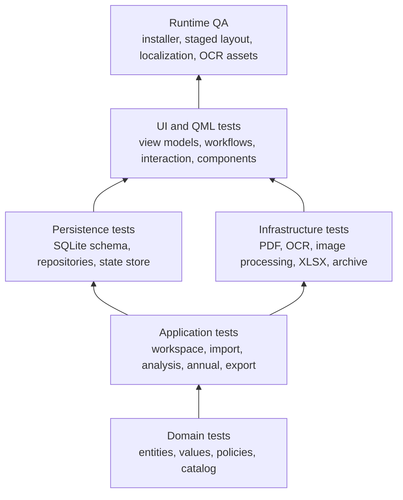
```mermaid
flowchart BT
  Domain["Domain tests<br/>entities, values, policies, catalog"]
  Application["Application tests<br/>workspace, import, analysis, annual, export"]
  Persistence["Persistence tests<br/>SQLite schema, repositories, state store"]
  Infrastructure["Infrastructure tests<br/>PDF, OCR, image processing, XLSX, archive"]
  UI["UI and QML tests<br/>view models, workflows, interaction, components"]
  Runtime["Runtime QA<br/>installer, staged layout, localization, OCR assets"]

  Domain --> Application
  Application --> Persistence
  Application --> Infrastructure
  Persistence --> UI
  Infrastructure --> UI
  UI --> Runtime
```

### 7.2 Matrix Summary

The design document keeps only the matrix grouping. Row-level traceability is
kept in [docs/appendix/test-matrices.md](appendix/test-matrices.md) so matrix
maintenance does not interrupt the architecture narrative.

Matrix grouping:

| Matrix | Scope |
|---|---|
| Core Layer Test Matrix | Domain, application and core port behavior. |
| Infrastructure Layer Test Matrix | Persistence and infrastructure adapters. |
| UI Layer Test Matrix | C++ UI source tests, interaction tests and QML behavior. |
| Deployment Runtime QA Matrix | Installer artifact, staged runtime layout, localization catalogs and OCR model assets. |

CI and deployment contracts are intentionally not embedded in this document.
They stay next to the scripts that validate them:

| Contract | Owner |
|---|---|
| `ci/package/package-layout-contract.json` | Staged runtime and installer layout. |
| `ci/localization/localization-contract.json` | UI translation catalogs and bundled OCR models. |

### 7.3 Test Execution

The full [CMake preset](appendix/reference.md#glossary-cmake-preset) inventory is documented in
Chapter 8 because presets are part of the build and deployment environment. The
QA chapter only documents the execution paths that quality gates consume.

| Purpose | Command |
|---|---|
| Configure all tests | `cmake --preset tests` |
| Build all release tests | `cmake --build --preset release-tests --parallel 2` |
| Run all release tests | `ctest --preset release-tests` |
| Configure clang-tidy | `cmake --preset clang-tidy` |
| Build clang-tidy target set | `cmake --build --preset release-clang-tidy --parallel 2` |
| Configure coverage | `cmake --preset coverage` |
| Build coverage target set | `cmake --build --preset release-coverage --parallel 2` |
| Collect coverage report | `.\ci\coverage\coverage-windows.ps1 -BuildDir .build\coverage -Config Release -OutDir coverage` |

### 7.4 Pipeline Quality Gates

The main [CI pipeline](appendix/reference.md#glossary-ci-pipeline) is `.github/workflows/pipeline.yml`
and is named `Pipeline`. It runs for pushes and pull requests on `develop` and
`master`, for `v*` tags, and by manual dispatch.

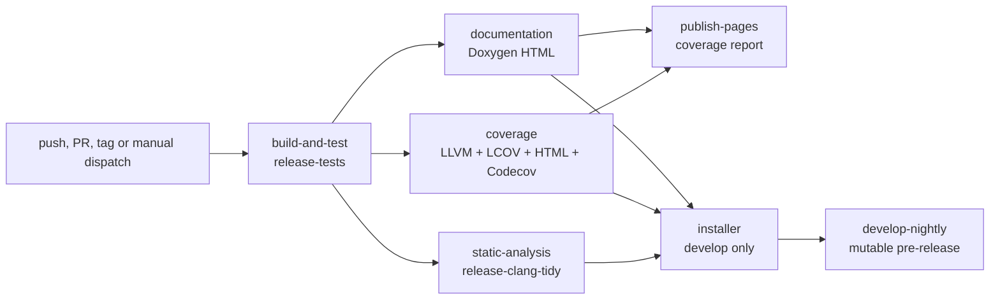
```mermaid
flowchart LR
  Trigger["push, PR, tag or manual dispatch"] --> Tests["build-and-test<br/>release-tests"]
  Tests --> Static["static-analysis<br/>release-clang-tidy"]
  Tests --> Coverage["coverage<br/>LLVM + LCOV + HTML + Codecov"]
  Tests --> Docs["documentation<br/>Doxygen HTML"]
  Coverage --> Pages["publish-pages<br/>coverage report"]
  Docs --> Pages
  Static --> Installer["installer<br/>develop only"]
  Coverage --> Installer
  Docs --> Installer
  Installer --> Nightly["develop-nightly<br/>mutable pre-release"]
```

| Gate | Workflow job | Required output |
|---|---|---|
| Test gate | `build-and-test` | `ctest --preset release-tests` passes. |
| Static-analysis gate | `static-analysis` | `release-clang-tidy` builds successfully. |
| Coverage gate | `coverage` | LCOV, HTML coverage and Codecov upload input are produced. |
| Documentation gate | `documentation` | Doxygen HTML artifact is produced. |
| Pages gate | `publish-pages` | GitHub Pages receives documentation and coverage HTML. |
| Localization gate | `installer`, `release` | `ci/localization/localization-contract.json` matches available translations and OCR models. |
| Runtime-layout gate | `installer`, `release` | `ci/package/package-layout-contract.json` matches the staged installer runtime. |
| Installer gate | `installer`, `release` | `FOSSredder-Setup-<version>-win-x64.exe` exists and passes package QA. |

### 7.5 Adding Or Changing Tests

Use this workflow when adding tests:

1. Start from the architectural owner: domain, application, persistence, infrastructure, UI source, QML or package QA.
2. Add or update the corresponding matrix row when the feature changes observable behavior.
3. Keep matrix IDs unique and update the row together with the matching test file or test function name.
4. Use underscore form in C++ and QML test names when a matrix ID is mirrored in code.
5. Place the test near the boundary it exercises.
6. Add the test source to the owning CMake test target.
7. Prefer domain policies and port fakes over broad end-to-end tests for business rules.
8. Use temporary SQLite files for persistence behavior that needs a real database.
9. Keep OCR/parser tests deterministic with generated fixtures or controlled input data.
10. Update layout, localization or workflow contracts when a feature adds a required runtime asset.

### 7.6 Traceability Rules

- Add or update tests at the architectural boundary that owns the behavior.
- Update [test matrices](appendix/test-matrices.md) when observable behavior or covered test scope changes.
- Update `ci/package/package-layout-contract.json` when a required runtime file, QML module or packaged asset changes.
- Update `ci/localization/localization-contract.json` when supported UI languages or bundled OCR models change.
- Keep test names searchable from matrix IDs when a matrix row maps to code.
- State skipped verification explicitly in the pull request.
- Keep includes, formatting and static-analysis behavior aligned with `.clang-format` and `.clang-tidy`.
- Keep public headers documented with Doxygen when public API changes.

## 8. Deployment & Environment <a id="8-deployment--environment"></a>

Deployment covers build presets, runtime layout, installer packaging, generated
reports and release channels. These mechanics turn source code into a runnable
desktop application.

### 8.1 Delivery Model

FOSSredder is Windows-first and installer-driven. The repository does not
currently publish a package-registry artifact such as Docker, NuGet or an SDK
package; the user-facing deliverable is the Windows installer attached to
GitHub Releases.

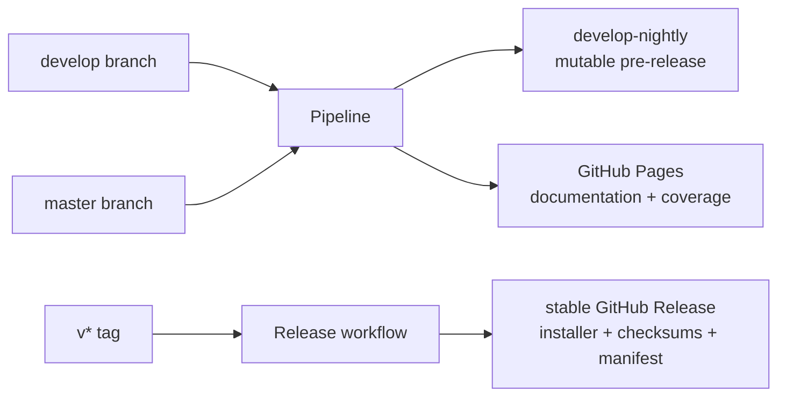
```mermaid
flowchart LR
  Develop["develop branch"] --> Pipeline["Pipeline"]
  Pipeline --> Nightly["develop-nightly<br/>mutable pre-release"]
  Master["master branch"] --> Pipeline
  Tag["v* tag"] --> ReleaseWorkflow["Release workflow"]
  ReleaseWorkflow --> Stable["stable GitHub Release<br/>installer + checksums + manifest"]
  Pipeline --> Pages["GitHub Pages<br/>documentation + coverage"]
```

| Runtime concern | Current contract |
|---|---|
| Operating system | Windows 10 or newer. |
| Architecture | x64 Windows. |
| UI runtime | Qt 6, QML and Qt Quick. |
| Local persistence | SQLite workspace and registry databases. |
| Import runtime | Poppler, OpenCV, Tesseract and bundled tessdata. |
| Export runtime | CSV, XLSX and ZIP/archive support. |

### 8.2 Build Presets

`CMakePresets.json` is the canonical entry point for local development and CI.
Raw generator commands should not be documented in normal workflows unless a new
preset cannot express the use case.

Configure presets:

| Configure preset | Generator | Purpose |
|---|---|---|
| `app` | Visual Studio 18 2026 | App configuration without tests. Used by normal app builds and installer packaging. |
| `app-fast` | Visual Studio 18 2026 | App configuration with fast QML build enabled. |
| `app-ninja-fast` | Ninja Multi-Config | Fast local app configuration with fast QML build enabled. |
| `tests` | Visual Studio 18 2026 | Full test configuration across core, persistence, UI, diagnostics and infrastructure tests. |
| `clang-tidy` | Visual Studio 18 2026 | Full test configuration with clang-tidy enabled. |
| `coverage` | Visual Studio 18 2026 with ClangCL toolset | Full test configuration with LLVM coverage enabled. |

Build and test presets:

| Preset | Type | Purpose |
|---|---|---|
| `debug-app`, `release-app` | Build | Build the application from the `app` configuration. |
| `debug-app-fast`, `release-app-fast` | Build | Build the application with fast QML mode. |
| `debug-app-ninja-fast`, `release-app-ninja-fast` | Build | Build the application with Ninja Multi-Config and fast QML mode. |
| `debug-tests`, `release-tests` | Build/Test | Build and run the full registered test suite. |
| `release-clang-tidy` | Build | Run clang-tidy as part of the configured build. |
| `release-coverage` | Build/Test | Build and run the LLVM coverage configuration. |
| `release-installer` | Build | Build the CMake `package` target. |

The installer workflows configure the `app` preset with the explicit
`FOSSREDDER_FAST_QML_BUILD=ON` cache override, then build `release-app` and the
`release-installer` package target.

### 8.3 Installed Runtime Layout

The [installer](appendix/reference.md#glossary-installer) must stage a self-contained
[runtime layout](appendix/reference.md#glossary-runtime-layout) under the installation directory.

```text
<install-root>/
  bin/
    fossredder.exe
    qt.conf
    platforms/
      qwindows.dll
    qml/
      FossRedder/
      QtQuick/
      ...
    i18n/
      *.qm
    res/
      tessdata/
        deu.traineddata
        eng.traineddata
        fra.traineddata
        osd.traineddata
        *-fast.traineddata
        *-best.traineddata
```

| Runtime path | Purpose |
|---|---|
| `bin/fossredder.exe` | Main application executable. |
| `bin/qt.conf` | Qt runtime path configuration. |
| `bin/platforms/qwindows.dll` | Required Qt Windows platform plugin. |
| `bin/qml` | Qt and FOSSredder QML imports. |
| `bin/i18n` | Compiled Qt translation catalogs. |
| `bin/res/tessdata` | Bundled [tessdata](appendix/reference.md#glossary-tessdata) OCR language and orientation models. |

The layout contract is explicit in `ci/package/package-layout-contract.json`.
It verifies required runtime files, Qt QML imports and the FOSSredder QML module
tree.

### 8.4 Installer Packaging Flow

The Windows installer is defined by `installer/inno/fossredder.iss` and include
files under `installer/inno/includes`.

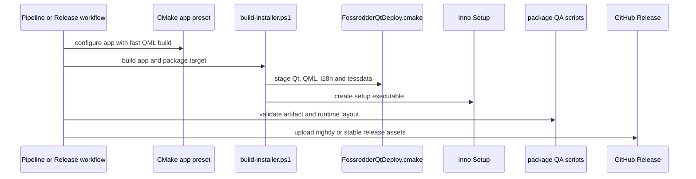
```mermaid
sequenceDiagram
    participant CI as Pipeline or Release workflow
    participant CMake as CMake app preset
    participant Build as build-installer.ps1
    participant Deploy as FossredderQtDeploy.cmake
    participant Inno as Inno Setup
    participant QA as package QA scripts
    participant GH as GitHub Release

    CI->>CMake: configure app with fast QML build
    CI->>Build: build app and package target
    Build->>Deploy: stage Qt, QML, i18n and tessdata
    Build->>Inno: create setup executable
    CI->>QA: validate artifact and runtime layout
    CI->>GH: upload nightly or stable release assets
```

| Component | Responsibility |
|---|---|
| `cmake/modules/FossredderPackaging.cmake` | Exposes the CMake `package` target. |
| `cmake/modules/FossredderQtDeploy.cmake` | Stages Qt plugins, QML imports and runtime configuration. |
| `ci/package/package-inno.ps1` | Runs CMake install, deploys runtime files and invokes Inno Setup. |
| `ci/package/validate-package.ps1` | Verifies that the expected installer artifact exists. |
| `ci/package/test-package-layout.ps1` | Verifies staged runtime files, QML modules, tessdata and installer assets. |
| `installer/assets` | Wizard banner and small image assets. |
| `installer/inno/includes` | Setup metadata, file rules, icons, languages, messages, tasks and run behavior. |

Installer artifact format:

```text
FOSSredder-Setup-<version>-win-x64.exe
```

### 8.5 Release Channels

| Release channel | Trigger | Intended audience | Output |
|---|---|---|---|
| Develop nightly | Successful `Pipeline` run on `develop` | Project testing and validation before master/release. | Mutable `develop-nightly` GitHub pre-release and short-lived workflow artifacts. |
| Stable release | Push of a `v*` tag | Public release users. | Immutable GitHub Release with installer, SHA256 sums and release manifest. |

The current installer is not documented as [code-signed](appendix/reference.md#glossary-code-signing).
Windows can therefore show an unknown-publisher warning until release signing is
added.

### 8.6 Documentation And Coverage Publishing

GitHub Pages publishes generated project reports from CI artifacts.

| Pages area | Source |
|---|---|
| Documentation | Doxygen HTML generated from `Doxyfile`. |
| Coverage report | HTML generated by `ci/coverage/coverage-windows.ps1`. |
| Landing page | `ci/pages/index.html`. |

Pages deployment runs from the `Pipeline` workflow on pushes to `develop` and
`master`. The repository must be configured for GitHub Pages deployment from
GitHub Actions.

### 8.7 User Data And Portability

[Workspace](appendix/reference.md#glossary-workspace) data is user-managed and portable.

| File | Role |
|---|---|
| `workspace.fossredder` | Canonical SQLite-backed workspace file. |
| `registry.db` | Local latest-workspace [registry](appendix/reference.md#glossary-registry). It can be recreated. |

Users can back up, copy or move `.fossredder` workspace files as regular files.
The registry is a convenience index and is not required to recover workspace
data.

### 8.8 Deployment Change Checklist

When deployment changes, update all related contracts together:

1. CMake install/package rules.
2. Qt deployment rules.
3. Inno Setup file/include rules.
4. Package layout contract.
5. Installer QA script.
6. Localization contract when languages or OCR models change.
7. Pipeline/release workflows when artifact paths or release channels change.
8. This design document.

## 9. Security & Privacy <a id="9-security--privacy"></a>

FOSSredder processes financial documents, OCR text, statement transactions and
derived accounting results. The security design is therefore based on a
local-first boundary, explicit data ownership and conservative defaults.

### 9.1 Threat Model

The current [threat model](appendix/reference.md#glossary-threat-model) focuses on local desktop use.
It does not claim enterprise endpoint management, encrypted workspace storage or
signed releases yet.

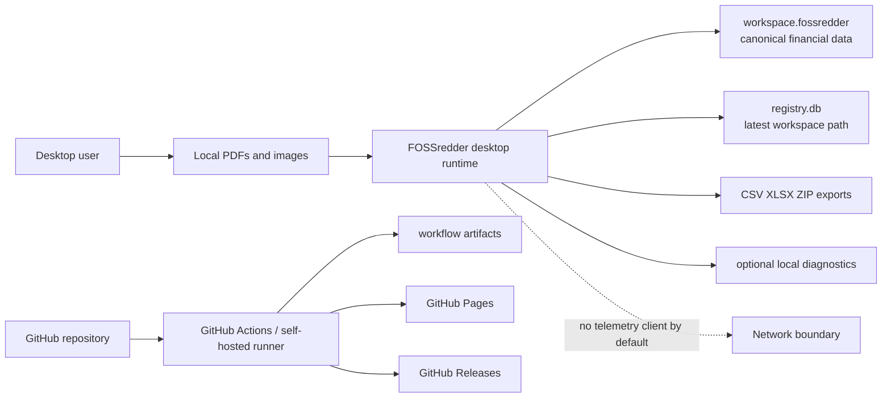
```mermaid
flowchart LR
  User["Desktop user"] --> Docs["Local PDFs and images"]
  Docs --> App["FOSSredder desktop runtime"]
  App --> Workspace["workspace.fossredder<br/>canonical financial data"]
  App --> Registry["registry.db<br/>latest workspace path"]
  App --> Exports["CSV XLSX ZIP exports"]
  App --> Diagnostics["optional local diagnostics"]
  App -. "no telemetry client by default" .-> Network["Network boundary"]

  Repo["GitHub repository"] --> CI["GitHub Actions / self-hosted runner"]
  CI --> Artifacts["workflow artifacts"]
  CI --> Pages["GitHub Pages"]
  CI --> Releases["GitHub Releases"]
```

| Risk | Current mitigation | Remaining gap |
|---|---|---|
| Accidental cloud upload of financial data | Desktop runtime has no telemetry or cloud client by default. | Future network features need explicit ports and documentation. |
| Sensitive data in local workspace | Workspace is a normal local SQLite file controlled by the user. | No transparent at-rest encryption yet. |
| Sensitive local paths in registry | Registry only stores latest workspace path and can be recreated. | Path disclosure is still possible on a compromised user profile. |
| Raw import artifacts outliving the workflow | Long-lived raw document caches are not part of the default contract. | Any future cache needs retention and deletion policy. |
| Unsigned installer trust warning | Release artifacts are validated by package QA. | Code signing is not implemented/documented yet. |
| CI secret exposure | Secrets are stored in GitHub secrets and scoped to workflows. | Runner hygiene remains an operational responsibility. |

### 9.2 Data Classification

| Data class | Examples | Persistence | Sensitivity |
|---|---|---|---|
| Raw source documents | PDFs and images selected by the user. | User-provided files outside the workspace unless explicitly imported/cached. | High |
| OCR and parser output | TSV data, parsed rows, proof images and parser diagnostics. | Import result/draft workflow state where needed. | High |
| Workspace data | Actors, properties, contracts, statements, transactions, analyses, annuals, drafts and logs. | `workspace.fossredder`. | High |
| Registry data | Latest workspace path. | `registry.db`. | Medium |
| Export output | CSV, XLSX and ZIP export bundles. | User-selected output paths. | High |
| CI artifacts | Coverage HTML, Doxygen HTML, package logs, installer artifacts. | GitHub Actions artifacts and Pages/Releases. | Low to medium, unless logs accidentally include local sensitive data. |

### 9.3 Runtime Privacy Boundary

Current enforcement points:

- Startup composition in `app/src/main.cpp` does not register cloud clients or telemetry clients.
- Core use cases run against local workspace snapshots and local infrastructure adapters.
- Error reporting is routed explicitly through `core::ports::diagnostics::IErrorReporter`; there is no process-wide core reporter registry and no external telemetry reporter is wired by default.
- GitHub, Codecov and Pages integrations exist only in CI workflows, not in the installed desktop runtime.

If a future feature introduces network access, it must be documented as a new
system boundary and hidden behind a core-owned [port](appendix/reference.md#glossary-port).

### 9.4 Storage And Encryption

Persistent data is stored in local SQLite files.

| Data | File | Implementation |
|---|---|---|
| Workspace state | `workspace.fossredder` | `persistence/WorkspaceStateStore`, `SqliteDb`, `SqliteSchema`, repository implementations. |
| Latest workspace registry | `registry.db` | `persistence/src/SqliteRegistry.cpp`. |
| UI preferences | Local UI settings services. |

The workspace file is the sensitive asset. The registry can reveal local file
paths, but it does not contain the workspace catalog itself.

There is no transparent [at-rest encryption](appendix/reference.md#glossary-at-rest-encryption) in
the current implementation. If encrypted workspaces become a requirement, add
the feature behind an explicit storage boundary. Candidate approaches:

- encrypted SQLite VFS,
- encrypted workspace export/import wrapper,
- password-protected external archive format.

Any encryption design must document key ownership, recovery behavior, migration
strategy and UI failure modes before implementation.

### 9.5 Diagnostics And Logging Rules

Import and OCR workflows may create or expose sensitive intermediate data.

| Artifact | Handling rule |
|---|---|
| OCR TSV data | Treat as statement-derived data; expose only where needed for review or diagnostics. |
| Parser logs | Keep diagnostic, deterministic and free from full financial document dumps unless user-controlled. |
| Proof images | Treat as sensitive because they can contain statement content. |
| Adapter diagnostic files | Keep optional and route through `core::ports::diagnostics::IDiagnostics` / `diagnostics::FileDiagnostics`. |
| Package logs | CI artifacts only; do not include user statement data. |

Implementation rule: do not add long-lived raw document caches without an
explicit retention and deletion policy.

### 9.6 CI, Secrets And Release Integrity

CI-only integrations use GitHub infrastructure boundaries.

| Secret or token | Scope |
|---|---|
| `GITHUB_TOKEN` | Used by workflows to upload artifacts, publish Pages and create/update releases. |
| `CODECOV_TOKEN` | Used only by the coverage upload script when present. |
| GitHub Pages OIDC token | Used only for Pages deployment. |

Release integrity rules:

- Do not store secrets in repository files.
- Keep workflow permissions scoped to each job.
- Treat stable release artifacts from `v*` tags as immutable.
- Treat `develop-nightly` as mutable and testing-only.
- Add code signing before claiming publisher identity in Windows installer flows.
- Preserve checksum and manifest generation for stable releases.

### 9.7 Security Hardening Backlog

| Backlog item | Why it matters | Recommended timing |
|---|---|---|
| Code signing | Removes unknown-publisher warning and improves installer trust. | Before a broader public release. |
| Workspace encryption design | Protects sensitive local financial data at rest. | When users require shared machines or stronger local privacy. |
| Dependency/SBOM reporting | Improves release transparency for third-party libraries. | Before packaging is advertised as production-grade. |
| Artifact retention review | Limits exposure of build logs and package artifacts. | Before public CI/release hardening. |
| Explicit network-access policy | Keeps local-first behavior enforceable if online features arrive. | Before any network feature. |

## 10. Reference Appendices <a id="reference-appendices"></a>

Long reference material is kept outside the main design narrative:

- [Design Appendix](appendix/reference.md) keeps the glossary, dependency list, runtime file index and reference index.
- [Test Matrices](appendix/test-matrices.md) keeps row-level QA traceability for core, infrastructure, UI, QML and deployment/runtime checks.
